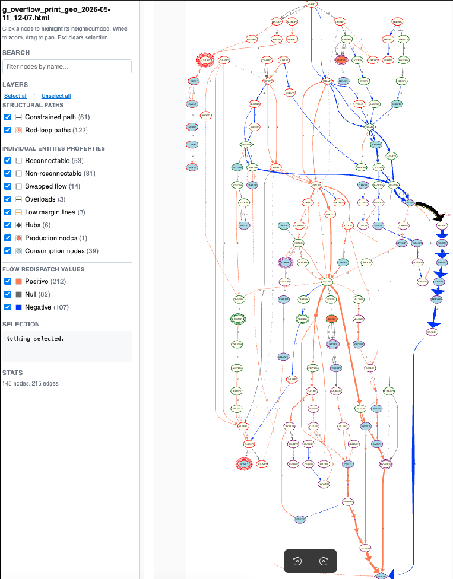
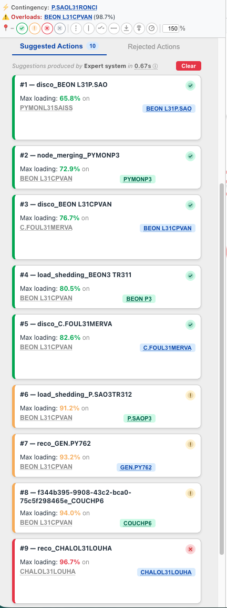
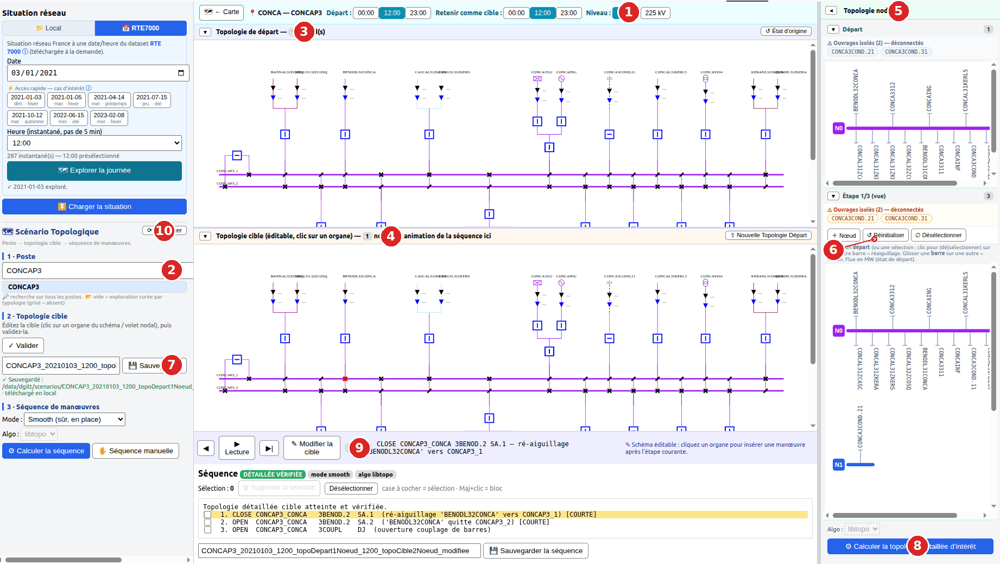
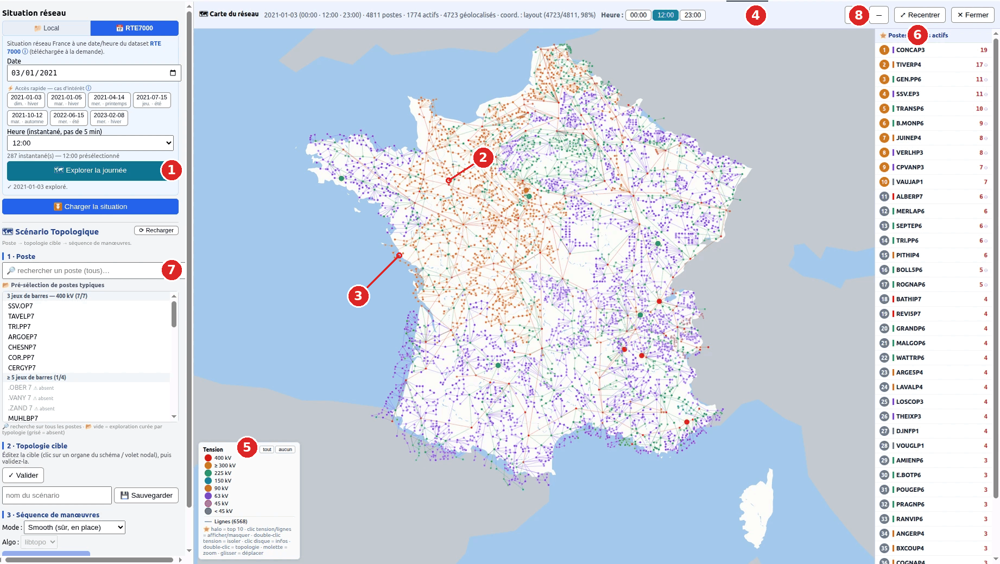

# ExpertOp4Grid Recommender

[](https://opensource.org/licenses/MPL-2.0)
[](https://www.python.org/downloads/)

Expert system recommender for power grid contingency analysis based on ExpertOp4Grid principles. This tool analyzes N-1 contingencies in Grid2Op/pypowsybl environments, builds overflow graphs, applies expert rules to filter potential actions, and identifies relevant corrective measures to alleviate line overloads.

The recommender is now **pluggable**: the analysis pipeline dispatches to any
class implementing the `RecommenderModel` ABC, with the rule-based expert
system shipped as the default. See
[Pluggable Recommendation Models](#pluggable-recommendation-models) below.

---

## Table of Contents

- [Quick Overview](#quick-overview)
- [Documentation](#documentation)
- [Features](#features)
- [Installation](#installation)
- [Usage Example](#usage-example)
- [Pypowsybl Backend](#pypowsybl-backend)
- [Pluggable Recommendation Models](#pluggable-recommendation-models)
- [Action Discovery and Scoring](#action-discovery-and-scoring)
- [Combining actions: the Generalized Superposition Theorem (GST)](#combining-actions-the-generalized-superposition-theorem-gst)
- [Configuration](#configuration)
- [Interactive Maneuver Interface (IHM)](#interactive-maneuver-interface-ihm)
- [Dependencies](#dependencies)
- [Testing](#testing)
- [License](#license)

---

## Quick Overview

ExpertOp4Grid Recommender has two complementary halves, used end to end by the
companion operator UI **[Co-Study4Grid](https://github.com/marota/Co-Study4Grid)**:

1. **The recommender** — given an N-1 contingency and the overloads it causes, it
   builds an overflow graph, filters candidate actions with expert rules, and
   returns a **ranked list of corrective actions** (line switching, node
   splitting/merging, PST, load shedding, renewable curtailment, redispatch),
   each re-simulated to report its effect on line loading.
2. **The maneuver module** — turns a chosen **nodal** action into a safe,
   **animated switching sequence** at the detailed (node-breaker) level, driven
   from a lightweight web IHM.

### 1 · The recommender — ranked corrective actions

The recommender has two faces in **[Co-Study4Grid](https://github.com/marota/Co-Study4Grid)**:
it builds an **interpretable overflow graph** of the contingency *(left)* —
constrained path, red/blue flow-redistribution loops, hubs — and **derives a
ranked feed of corrective actions** from it *(right)*.

<table>
<tr>
<td valign="top" align="center">
  
  <br/><sub><b>Overflow analysis graph</b> — stackable layer filters reveal the
  constrained path and the flow-redistribution root cause that the candidate
  actions act upon.</sub>
</td>
<td valign="top" align="center">
  
  <br/><sub><b>Ranked action feed</b> — for contingency <code>P.SAOL31RONCI</code>
  (overload <code>BEON L31CPVAN</code>, 98.7%): families <code>disco_</code>,
  <code>node_merging_</code>, <code>load_shedding_</code>, <code>reco_</code>,
  each with its post-action max loading and a green ✓ / amber ! / red ✗ severity
  badge.</sub>
</td>
</tr>
</table>

> *Screenshots from the companion [Co-Study4Grid](https://github.com/marota/Co-Study4Grid) operator UI.*

### 2 · The maneuver module — from a nodal action to a switching sequence

Once a **nodal** action is chosen, the `manoeuvre` module plans the detailed
(node-breaker) target topology and the safe, ordered switching sequence to reach
it — explored interactively through the web IHM (see the
[dedicated section](#interactive-maneuver-interface-ihm) below). The IHM has **two
complementary views**: **edit & sequence** a substation's target topology *(first
view)*, or — on the RTE-7000 dataset — **explore a whole day on a France map** to
spot the substations that actually moved and dive into one *(second view)*.

#### First view — editing & sequencing



> **Fig. — Maneuver IHM on substation CONCAP3**, opened by double-clicking it on the
> day-exploration map. Numbered affordances:
> **(1)** the **exploration bar** — **← Carte** (back to the map), **Départ** and
> **Retenir comme cible** hour pickers (00:00 / 12:00 / 23:00) and a **Niveau**
> selector: this view was reached from the map, which seeded the departure and target
> topologies;
> **(2)** **1 · Poste** — the unified search, here **CONCAP3** (any NODE_BREAKER
> substation is reachable by name);
> **(3)** the read-only **Topologie de départ** + **↺ État d'origine** (reset the
> target to pristine);
> **(4)** the **editable Topologie cible** (click a breaker/disconnector to toggle) +
> **⇧ Nouvelle Topologie Départ** (promote the edited target to a new departure);
> **(5)** the **Topologie nodale** bus view (drag a feeder to re-route, drag a busbar
> onto another to merge, **+ Nœud**);
> **(6)** **⚠ Ouvrages isolés (2) — déconnectés** — disconnected devices that carry no
> busbar are flagged and **excluded from the electrical-node count** (CONCAP3 reads
> **1 node**, not inflated by the two isolated ouvrages);
> **(7)** **2 · Topologie cible** — **✓ Valider** then **💾 Sauvegarder** under a
> **pre-formatted name** (`CONCAP3_20210103_1200_topoDepart1Noeud_…`) into the
> **shared scenario base** (here `/data/dgitt/scenarios`, also downloaded locally);
> **(8)** **⚙ Calculer la topologie détaillée d'intérêt** — the nodal→detailed bridge;
> **(9)** **3 · Séquence de manœuvres** — the **step-by-step animated**, *détaillée
> vérifiée* sequence (here 1/3: `CLOSE … ré-aiguillage`, then `OPEN … ouverture
> couplage de barres`) with **💾 save**;
> **(10)** **⟳ Recharger** replays a saved scenario from the shared base (searchable
> by voltage, busbar count, substation, OC counts and date; zip export).
> Bus colours are the native `topological_coloring`.

#### Second view — exploring a day on the France map



> **Fig. — "Explorer la journée": the France map of substation activity**
> (RTE-7000, 2021-01-03; three snapshots 00:00 / 12:00 / 23:00). Numbered
> affordances:
> **(1)** **🗺 Explorer la journée** — from the *RTE7000* tab, after picking a date,
> opens the France map (**no setup, no network**: coordinates from the committed RTE
> grid layout, ~98 % of substations, over a real *départements* basemap);
> **(2)** one **disk per substation, coloured by voltage** (RTE palette); the **10
> most active voltage levels** of the day are **enlarged + ranked** — activity =
> switching-device (OC) state changes broken down **DJ / SA / INT**, **plus ⚇ node
> re-groupings** (splits/merges);
> **(3)** optional **inter-substation connections** — electrical lines coloured by
> voltage, drawn faint (constant width at any zoom), toggled by **Lignes** in the
> legend (available for *Local* **and** *RTE7000*);
> **(4)** the **hour selector** 00:00 / 12:00 / 23:00 — picks which snapshot's
> topology is opened on double-click;
> **(5)** the **filtering voltage legend** — *tout* / *aucun*, single-click a band to
> show/hide it, **double-click to isolate** it, plus a **Lignes** toggle; the help
> line spells out *halo = top 10 · clic = infos · double-clic = topologie · molette =
> zoom · glisser = déplacer*;
> **(6)** **★ Postes les plus actifs** — the clickable ranking with per-VL change
> counts;
> **(7)** **1 · Poste** search — usable while the map is open (jump straight to a
> substation);
> **(8)** map controls — **+ / −** zoom, **↗ Recentrer**, **✕ Fermer**; the header
> reports **4811 postes · 1774 actifs · 4723 géolocalisés · coord. : layout
> (4723/4811, 98 %)**.
> **Double-click a disk** → it opens in the **first view** above, its departure/target
> seeded from the chosen hours (devices differing départ→cible are highlighted on the
> target diagram: **green** = closed, **orange** = opened). An OSM/Overpass fallback
> fills coordinates absent from the layout and is offered for download
> (**⬇ coordonnées**).

---

## Documentation

New here? Start with the **[architecture & overall-understanding overview](docs/architecture/overview.md)**.
The full documentation index is in [`docs/README.md`](docs/README.md) —
architecture & simulation pipeline, the recommender's action designs, the maneuver
module & web IHM, the RTE-7000 dataset, release notes, and the archive.

---

## Features

* **Contingency Simulation**: Simulates N-1 contingencies in a Grid2Op environment.
* **Overflow Graph Generation**: Builds and visualizes overflow graphs using `alphaDeesp` and `networkx`.
* **Expert Rule Engine**: Filters potential grid actions (line switching, topology changes) based on predefined rules derived from operator expertise.
* **Action Prioritization**: Identifies and scores relevant corrective actions (line reconnections, disconnections, node splitting/merging).
* **Pluggable Recommendation Models**: the rule-based expert system is one
  implementation of the `RecommenderModel` contract; external models
  (random baselines, ML policies, …) plug in through the same DTO with
  no changes to the analysis pipeline. See
  [Pluggable Recommendation Models](#pluggable-recommendation-models).
* **Modular Structure**: Organized code for better maintainability and testing.

---

## Installation

1.  **Clone the repository:**
    ```bash
    git clone https://github.com/marota/Expert_op4grid_recommender.git
    cd Expert_op4grid_recommender
    ```

2.  **Recommended: Create a virtual environment:**
    ```bash
    python -m venv venv
    source venv/bin/activate  # On Windows use `venv\Scripts\activate`
    ```

3.  **Install the package and dependencies:**
    * **Core dependencies:** Make sure you have the necessary libraries installed. If `alphaDeesp` or specific `grid2op` versions are not on PyPI, you might need to install them manually first according to their own instructions.
    * **Install this package:** For development (recommended), use editable mode:
        ```bash
        pip install -e .
        ```
        Or for a standard installation:
        ```bash
        pip install .
        ```
    * **Install test dependencies (optional):**
        ```bash
        pip install -e .[test]
        ```

---

## Usage Example

Configure the desired scenario in `expert_op4grid_recommender/config.py` (Date, Timestep, Contingency Lines, etc.).

Then, run the main analysis script from the **project root directory**:

```bash
python expert_op4grid_recommender/main.py --date 2024-08-28 --timestep 36 --lines-defaut FRON5L31LOUHA P.SAOL31RONCI
```

The script will:

1.  Set up the Grid2Op environment.
2.  Simulate the specified contingency.
3.  Build and save an overflow graph visualization in the `Overflow_Graph/` directory.
4.  Apply expert rules to filter actions loaded from the action space file.
5.  Identify and print a list of prioritized corrective actions.

---

## Pypowsybl Backend

The `pypowsybl` backend provides a high-performance alternative to Grid2Op for network simulation and what-if analysis.

### Performance Optimizations
*   **Incremental Branching**: Remedial actions are simulated directly from the converged N-1 state using network variants, significantly reducing computation time.
*   **Vectorized State Reading**: Core network state (flows, voltages, bus assignments) is read using vectorized pypowsybl operations.
*   **Batched Action Application**: Multiple topological changes are applied in batches to minimize overhead.

> [!NOTE]
> **Simulation Simplification**: To maximize speed during what-if analyses (N-1 and remedial actions), voltage control for transformers and shunts is disabled in variant simulations. The base N-state observation maintains full regulation to provide a high-fidelity reference point.

> [!TIP]
> For a complete description of the simulation pipeline — load-flow modes (AC/DC, fast/slow), voltage initialisation strategies, the `DC_VALUES` fallback on non-converged status, variant lifecycle, thermal-limit hypotheses, and the four available retry branches — see [`docs/architecture/simulation-pipeline.md`](docs/architecture/simulation-pipeline.md).

An option that can be activated for specific use is to rebuild an action space from one segmentation of a grid to another or the full grid:

```bash
python expert_op4grid_recommender/main.py --rebuild-actions --repas-file allLogics.json --grid-snapshot-file data/snapshot/pf_20240828T0100Z_20240828T0100Z.xiidm
```

From all known logics on the full grid, and targeted action ids in the ACTION_FILE, it rebuilds the actions to be applied on the grid snapshot (in detailed topology format with switches) at the date of interest.

---

## Pluggable Recommendation Models

The analysis pipeline dispatches to any class implementing the
`RecommenderModel` ABC. The rule-based expert system (`ExpertRecommender`)
is one such implementation, registered as the default. Third-party models
(random baselines, ML policies, learnt heuristics, …) plug into the same
DTO with no changes to the pipeline.

### The contract

```python
from expert_op4grid_recommender.models.base import (
    RecommenderModel, RecommenderInputs, RecommenderOutput, ParamSpec,
)

class MyModel(RecommenderModel):
    name = "my_model"                       # registry key (snake_case)
    label = "My Model"                      # UI label
    requires_overflow_graph = False         # capability flag

    @classmethod
    def params_spec(cls) -> list[ParamSpec]:
        # Parameters the model consumes. UI hides anything not listed here.
        return [
            ParamSpec("n_prioritized_actions", "N", "int",
                      default=5, min=1, max=50),
        ]

    def recommend(self, inputs: RecommenderInputs, params: dict) -> RecommenderOutput:
        # Use any of the pre-computed pipeline data on `inputs`
        # (DTO details below). Return raw actions — the reassessment
        # phase (rho-before / rho-after / max_rho / simulated obs /
        # non-convergence / combined-pair superposition) runs
        # automatically and shapes the action cards uniformly across
        # every model.
        return RecommenderOutput(
            prioritized_actions={action_id: action_obj, ...},
            action_scores={},   # free-form; may be empty
        )
```

### What's on `RecommenderInputs`

Everything the pipeline has already computed — your model picks what
helps, ignores the rest.

**Always populated**

| Field                       | Description                                                |
|-----------------------------|------------------------------------------------------------|
| `obs` / `network`           | N state — observation paired with its pypowsybl `Network`. |
| `obs_defaut` / `network_defaut` | N-K state — post-fault observation paired with its `Network`. |
| `lines_defaut`              | Names of the lines forming the contingency (N-K).          |
| `lines_overloaded_names`    | Names of constrained lines under the N-K state.            |
| `lines_overloaded_ids`      | Indices into `obs_defaut.name_line`, paired with `_names`. |
| `lines_overloaded_rho`      | Loading rate of each constrained line — pre-extracted as `list[float]`. |
| `lines_overloaded_ids_kept` | Subset retained after the island-prevention guard.         |
| `pre_existing_rho`          | `{line_idx: rho_N}` for lines already overloaded in N.     |
| `dict_action`               | Action dictionary (id → entry).                            |
| `env` / `classifier`        | Simulation environment + `ActionClassifier`.               |
| `timestep`                  | Current timestep.                                          |

**Optional — populated only when the overflow graph step ran** (because
the model required it, or the operator opted in via Co-Study4Grid's
`Compute Overflow Graph` toggle):

| Field                        | Description                                                  |
|------------------------------|--------------------------------------------------------------|
| `overflow_graph`             | alphaDeesp overflow graph.                                   |
| `distribution_graph`         | Structured overload distribution graph (paths + hubs).       |
| `overflow_sim`               | Associated alphaDeesp simulator.                             |
| `hubs`                       | Hub substation names (node-splitting candidates).            |
| `node_name_mapping`          | Internal index → substation-name mapping.                    |
| `non_connected_reconnectable_lines` | Reconnectable line candidates.                        |
| `lines_non_reconnectable`    | Disconnected lines NOT eligible for reconnection.            |
| `lines_we_care_about`        | Operator-supplied monitoring list.                           |
| `filtered_candidate_actions` | Action IDs retained by the expert `ActionRuleValidator`. Available to ANY model that has the graph in context, so non-expert models can sample inside the same reduced action space. |

### Built-in: `ExpertRecommender`

The historical rule-based discovery + scoring pipeline, exposed through
the new interface. Lives in
[`expert_op4grid_recommender/models/expert.py`](expert_op4grid_recommender/models/expert.py).
Behaviour for existing callers is unchanged — it remains the default.

### Reusable pipeline phases

Three pieces of infrastructure your model gets for free:

1. **Reassessment** (`utils/reassessment.py`): simulates each returned
   action and builds the rich card payload (rho-before / rho-after /
   `max_rho` / `is_rho_reduction` / non-convergence reason /
   post-action observation). Schema is preserved verbatim from the
   historical expert pipeline, so existing UI consumers work
   unchanged.
2. **Combined-pair superposition**: pairwise superposition theorem on
   every detailed-action pair. Decorative metadata — failures never
   break the main flow.
3. **`_run_expert_action_filter(context)`**: the path analysis + rule
   validation step that produces `filtered_candidate_actions`.
   Idempotent and invoked automatically by
   `run_analysis_step2_discovery` whenever the overflow graph is
   available — so any model that wants the expert-reduced action set
   just reads it off `inputs.filtered_candidate_actions`.

### Where the registry lives

The library only defines the **contract**. The model **registry** lives
on the app side (`marota/Co-Study4Grid`) so the app stays in control
of which models it exposes to operators. Canonical random examples,
the registration mechanism, and the step-by-step plug-in guide are in
[`marota/Co-Study4Grid` — Plug Your Own Recommendation Model](https://github.com/marota/Co-Study4Grid#plug-your-own-recommendation-model).

### Full reference

[`docs/architecture/recommender_models.md`](docs/architecture/recommender_models.md) — complete
contract reference: every field on `RecommenderInputs` and
`RecommenderOutput` with descriptions, the reusable pipeline phases,
the integration point (`run_analysis_step2_discovery`), a minimal
new-model example, and the test layout.

---

## Action Discovery and Scoring

After building the overflow graph and filtering candidate actions with expert rules, the `ActionDiscoverer` evaluates and scores each candidate action by type. Each type has its own filtering criteria to narrow down candidates before scoring. The resulting scores are returned in an `action_scores` dictionary with four keys. Each type contains `"scores"` (action scores sorted by descending value) and `"params"` (underlying hypotheses and parameters used for scoring):

```python
action_scores = {
    "line_reconnection": {
        "scores": {action_id: score, ...},  # sorted desc
        "params": {
            "percentage_threshold_min_dispatch_flow": float,
            "max_dispatch_flow": float,
        }
    },
    "line_disconnection": {
        "scores": {action_id: score, ...},  # sorted desc
        "params": {
            "min_redispatch": float,
            "max_redispatch": float,
            "peak_redispatch": float,  # value where score peaks (at 80% of range)
        }
    },
    "open_coupling": {
        "scores": {action_id: score, ...},  # sorted desc
        "params": {  # per-action details
            action_id: {
                "node_type": str,          # "amont", "aval", or other
                "bus_of_interest": int,    # bus number used for scoring
                "in_negative_flows": float,
                "out_negative_flows": float,
                "in_positive_flows": float,
                "out_positive_flows": float,
            }, ...
        }
    },
    "close_coupling": {
        "scores": {action_id: score, ...},  # sorted desc
        "params": {
            "percentage_threshold_min_dispatch_flow": float,
            "max_dispatch_flow": float,
        }
    },
}
```

### Line Reconnection Score (delta-theta)

**Filtering:** Only disconnected lines that are reconnectable and appear on dispatch paths of the overflow graph are considered. Among those, each candidate is checked for a valid red loop path: the path must not be blocked by other disconnected lines that have no active bypass. Additionally, the dispatch flow at the path extremities must exceed a minimum threshold (default 10% of the global max dispatch flow) to ensure the reconnection would have a significant impact.

**Scoring:** The remaining candidates are scored by the **voltage angle difference** (delta-theta) across the line's endpoints:

```
score = |theta_or - theta_ex|
```

A lower delta-theta indicates that the line can be reconnected with less stress on the grid. Actions are sorted by ascending delta-theta (lower is better).

### Line Disconnection Score (asymmetric bell curve)

Disconnection candidates are lines on the constrained path (blue path) of the overflow graph. The score evaluates whether the redispatch flow from disconnecting the line falls within a useful range:

**Flow bounds:**
- `max_overload_flow`: maximum absolute redispatch flow on the overflow graph (MW)
- `min_redispatch = (rho_max_overloaded - 1.0) * max_overload_flow` -- the minimum flow needed to bring the worst overloaded line below 100%
- `max_redispatch`: the binding constraint across all lines with increased loading, computed as:

```
For each line with delta_rho > 0:
    ratio = capacity_line * (1 - rho_before) / (rho_after - rho_before)
    max_redispatch = min(max_redispatch, ratio)
```

**Scoring function:** An asymmetric bell curve based on a Beta(3.0, 1.5) kernel, normalized so the peak equals 1 and occurs at 80% of the [min, max] range (i.e., closer to max_redispatch):

```
x = (observed_flow - min_redispatch) / (max_redispatch - min_redispatch)

If 0 <= x <= 1:  score = Beta_kernel(x; alpha=3.0, beta=1.5) / peak_value
If x < 0:        score = -2.0 * x^2        (quadratic penalty)
If x > 1:        score = -2.0 * (x - 1)^2  (quadratic penalty)
```

The score is positive when the disconnection relieves the right amount of flow, with higher scores for actions closer to the maximum useful redispatch. It becomes negative when the redispatch is too small (ineffective) or too large (would create new overloads).

### Node Splitting Score (open coupling -- weighted repulsion)

Node splitting candidates are substations that are either hubs of the overflow graph or lie on the constrained path. The scoring uses `AlphaDeesp` to evaluate how well splitting a substation into two buses separates opposing flows.

The score is based on the **weighted repulsion** of flows on the bus of interest:

```
TotalFlow = NegativeInflow + NegativeOutflow + PositiveInflow + PositiveOutflow

For upstream (amont) nodes:
    Repulsion = NegativeOutflow - PositiveOutflow
    WeightFactor = (NegativeOutflow - OtherFlows) / TotalFlow

For downstream (aval) nodes:
    Repulsion = NegativeInflow - PositiveInflow
    WeightFactor = (NegativeInflow - OtherFlows) / TotalFlow

Score = WeightFactor * Repulsion
```

A higher score indicates a better separation of the overload-relieving (negative/red) flows from the overload-aggravating (positive/green) flows.

### Node Merging Score (close coupling -- delta phase)

**Filtering:** Only substations that lie on loop dispatch paths (red loops) and currently have 2 or more connected buses are candidates. They are further filtered by requiring a minimum dispatch flow at the node (at least 10% of the global max dispatch flow) to ensure the merge would have a significant impact on the overload.

**Scoring:** The score is the **delta phase** (voltage angle difference) between the two buses being merged:

```
score = theta2 - theta1
```

where theta1 is the voltage angle of the bus connected to the red loop (identified as the bus carrying more negative/overload-relieving dispatch flow on the overflow graph), and theta2 is the voltage angle of the other bus. A positive score means flows would naturally go from the higher-phase bus towards the red loop bus, which is the desired direction to relieve overloads.

---

## Combining actions: the Generalized Superposition Theorem (GST)

The scores above rank actions **one at a time**, but operators often relieve an
overload with a **pair** of actions (e.g. a node split *plus* some load shedding).
Re-simulating every combination is expensive; instead the **superposition theorem**
reconstructs a combined flow from the per-action observations the analysis has
**already** computed — so a pair's impact is estimated with *no extra load flow*.
The core lives in `utils/superposition.py`; full derivation in
[`docs/recommender/superposition_module.md`](docs/recommender/superposition_module.md).

* **EST (Extended Superposition Theorem)** combines two **topology** actions (line
  open/close, node split/merge, PST). Each action gets a coefficient `beta` solving
  a small linear system built from `p_or` and `delta_theta`, and the combined flow is

  ```
  p_combined = (1 − Σβ)·p_start + β₁·p_act1 + β₂·p_act2
  ```

* **GST (Generalized Superposition Theorem)** extends this to pairs where **at least
  one action is an injection change** — load shedding (`set_load_p`), renewable
  curtailment / redispatch (`set_gen_p`) — which move nodal injections rather than the
  topology. `is_injection_action(...)` flags them (by id prefix or classifier type);
  `compute_combined_pair_superposition` then routes the pair to
  `compute_combined_pair_gst`, and `compute_all_pairs_superposition` now **keeps**
  injection actions (previously skipped), pairing them with topology actions and with
  each other.

An injection action enters in **pure superposition** (its response
`obs_inj − obs_start` is added in full); a topology partner keeps a `beta_T` that the
injection shifts only through the right-hand side of the unchanged EST system. The
trick: GST reports each injection action with **`beta = 1.0`**, so the **same EST
reconstruction formula above reproduces the exact GST flows** — the rho estimators and
Co-Study4Grid's `compute_combined_rho` need **no GST-specific code path**.

| Pair shape | betas | reconstruction |
|---|---|---|
| topology + injection | `[beta_T, 1.0]` | `−beta_T·start + beta_T·topo + inj` |
| injection + injection | `[1.0, 1.0]` | `inj1 + inj2 − start` (DC-exact) |

The estimator is **AC-anchored** (every term comes from AC load-flow observations,
not a recomputed DC model). Combined-pair estimates (virtual flows + combined rho)
flow back into the analysis results, letting the UI rank **action combinations**
alongside single actions.

---

## Configuration

Key parameters can be adjusted in `expert_op4grid_recommender/config.py`:

  * `DATE`, `TIMESTEP`, `LINES_DEFAUT`: Define the specific case to analyze.
  * `ENV_FOLDER`, `ENV_NAME`: Specify the Grid2Op environment location.
  * `ACTION_FILE_PATH`: Path to the JSON file containing the action space.
  * `USE_DC_LOAD_FLOW`: Set to `True` to use DC power flow if AC flow fails.
  * `PARAM_OPTIONS_EXPERT_OP`: Thresholds and parameters for the overflow graph analysis.

---

## Interactive Maneuver Interface (IHM)

A lightweight web IHM (`scripts/manoeuvre_ihm.py`) drives the `manoeuvre`
module interactively: pick a substation, edit a **target detailed topology**,
compute and **animate the switching sequence**, and save scenarios/sequences.
It also backs the hosted **TopologyManoeuver4Grid** HuggingFace Space (network
situations sourced on demand from the RTE-7000 dataset by date/hour).

See the **annotated walkthrough** in the [Quick Overview](#quick-overview) above
for the numbered tour of the interface. Full guide:
[`docs/manoeuvre/ihm.md`](docs/manoeuvre/ihm.md).

---

## Dependencies

This project relies on several external libraries, including:

  * `numpy`
  * `pandas`
  * `networkx`
  * `pypowsybl`
  * `grid2op` (Ensure you have a compatible version installed)
  * `alphaDeesp` (Ensure this library is installed in your environment)
  * `expertop4grid>=0.2.8`

See `pyproject.toml` for the full list.

---

## Testing

To run the unit and integration tests, navigate to the project root and use `pytest`:

```bash
pytest
```

*Note: Some integration tests (`@pytest.mark.slow`) require the Grid2Op environment data to be present and may take longer to run.*

---

## License

This project is licensed under the Mozilla Public License 2.0 (MPL 2.0). See the [LICENSE](LICENSE) file for details.
