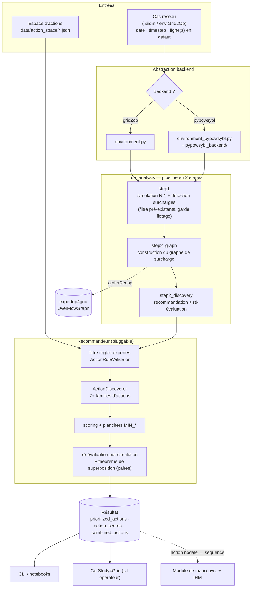
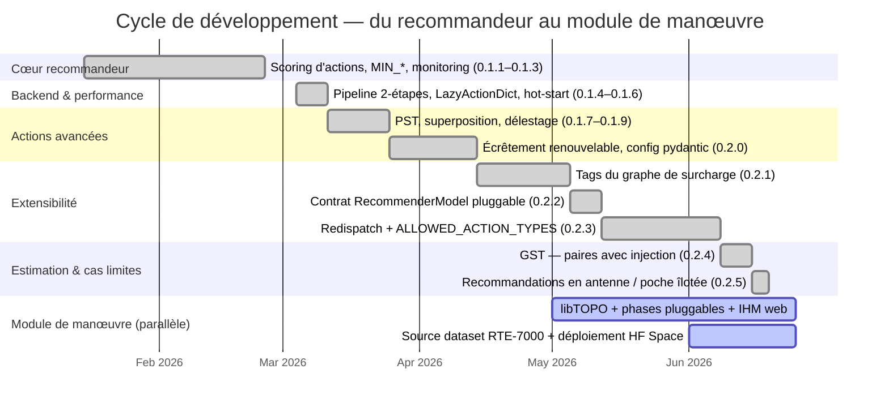
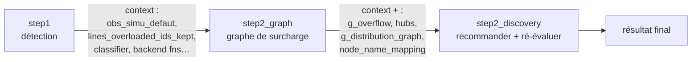
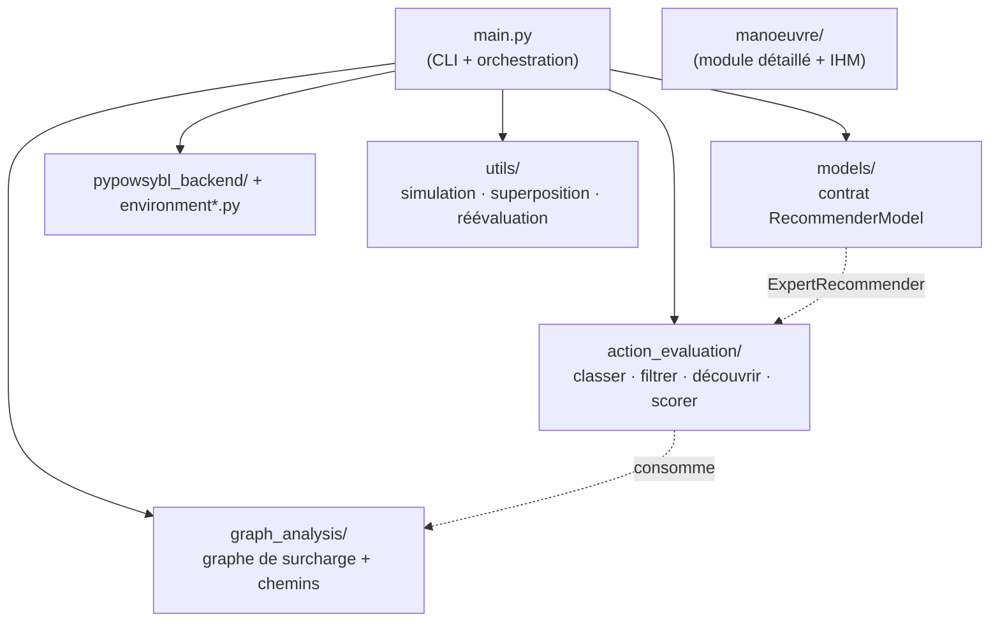

# Architecture et compréhension d'ensemble

> **Objectif** : donner une vue d'ensemble du fonctionnement d'**ExpertOp4Grid
> Recommender** — ce qu'il calcule, comment les modules s'enchaînent, et où
> intervenir. C'est la **porte d'entrée** de la documentation : chaque section
> renvoie vers le document de détail correspondant. Reconstruit à partir du code
> et du [`CHANGELOG.md`](../../CHANGELOG.md).
>
> **Public** : nouveaux contributeurs, intégrateurs (Co-Study4Grid, notebooks),
> et toute personne qui veut « la carte avant le territoire ». Récit en français,
> identifiants de code en anglais (à l'image de la doc Co-Study4Grid).

---

## 1. Vue d'ensemble

### 1.1 Ce que fait l'outil

Le recommandeur analyse une **contingence N-1** (une ou plusieurs lignes mises en
défaut) sur un réseau électrique, détecte les **surcharges** induites, puis
propose une liste **priorisée d'actions correctives** capables de soulager ces
surcharges. Il s'appuie sur un **graphe de surcharge** (la cartographie de la
redistribution des flux) et un ensemble de **règles expertes** pour ne retenir
que les actions pertinentes, qu'il **rejoue par simulation** pour mesurer leur
effet réel (`rho` avant/après).

> **En une phrase** : *contingence → surcharges → graphe de surcharge → actions
> candidates filtrées → scoring → ré-évaluation par simulation → actions
> priorisées.*

### 1.2 Architecture d'ensemble

### 1.3 Chronologie (cycle de développement)

Le projet a grandi par vagues : un cœur de recommandation, puis un backend
pypowsybl performant, des familles d'actions de plus en plus riches, un théorème
de superposition pour estimer les combinaisons, un **contrat de modèle
pluggable**, et enfin les cas limites (antenne) — avec, en piste parallèle, le
**module de manœuvre** et son IHM. (Release initiale : 0.1.0, 2025 ; détail dans
le [`CHANGELOG.md`](../../CHANGELOG.md) et les
[notes de version](../release-notes/).)

---

## 2. Le pipeline d'analyse de bout en bout

Depuis la v0.1.5, `run_analysis(...)` (dans `main.py`) délègue à **trois
fonctions** enchaînées, ce qui permet à un appelant externe (UI, notebook)
d'intervenir **entre les étapes** (p. ex. réutiliser une observation N-1 déjà
calculée pour un schéma, ou modifier la liste des lignes à couper avant la
construction du graphe).

| Fonction | Rôle | Entrées clés | Sorties clés (dans le `context`) |
|----------|------|--------------|----------------------------------|
| `run_analysis_step1(...)` | Monte l'environnement, **simule la contingence N-1**, détecte les surcharges, filtre les **surcharges pré-existantes**, applique la **garde d'îlotage**, détecte le **mode antenne**. | `analysis_date`, `current_timestep`, `current_lines_defaut` (+ `prebuilt_*` optionnels) | `obs_simu_defaut`, `lines_overloaded_ids_kept`, `lines_overloaded_names`, `classifier`, fonctions de backend |
| `run_analysis_step2_graph(context)` | Construit le **graphe de surcharge** (via alphaDeesp), calcule chemins contraints / boucles de report / hubs, rend la visualisation (non bloquante). | `context` de step1 | `g_overflow`, `overflow_sim`, `hubs`, `g_distribution_graph`, `node_name_mapping`, `df_of_g` |
| `run_analysis_step2_discovery(context, recommender=None, params=None)` | Applique le **filtre de règles**, lance le **modèle** (`ExpertRecommender` par défaut), **ré-évalue** chaque action par simulation, estime les **paires** par superposition. | `context` de step2_graph (+ modèle optionnel) | `prioritized_actions`, `action_scores`, `combined_actions`, temps par étape |

Le `context` est un **dictionnaire partagé** (≈ 40 champs) qui transporte l'état
du pipeline d'une étape à l'autre : handles d'environnement, observations,
métadonnées lignes/nœuds, `classifier`, et les **fonctions de backend** déjà
résolues. Si step1 ne trouve aucune surcharge exploitable (et que le mode antenne
ne s'applique pas), il **sort tôt** avec une liste d'actions vide.

> **Détail load-flow** : modes AC/DC, init `PREVIOUS_VALUES`/`DC_VALUES`, cycle de
> vie des variantes et hypothèses de limites thermiques sont décrits dans
> [`simulation-pipeline.md`](simulation-pipeline.md).

---

## 3. L'abstraction backend (grid2op ↔ pypowsybl)

`main.py` choisit, selon l'enum `Backend`, un **jeu de fonctions** équivalentes —
les deux backends exposent la même interface d'observation/d'action, si bien que
le reste du pipeline est agnostique.

| Responsabilité | Backend `grid2op` | Backend `pypowsybl` |
|----------------|-------------------|---------------------|
| Montage environnement | `environment.py` | `environment_pypowsybl.py` + `pypowsybl_backend/` |
| Simulation contingence | `utils/simulation.py` | `utils/simulation_pypowsybl.py` |
| Graphe de surcharge | `graph_analysis/builder.py` (**alphaDeesp**) | `pypowsybl_backend/overflow_analysis.py` |
| Repli DC | `environment.py` | `environment_pypowsybl.py` |

Le backend **pypowsybl** est la voie performante (branchement incrémental « hot
start » depuis l'état N-1 convergé, observation vectorisée, `PYPOWSYBL_FAST_MODE`).
**`grid2op` est optionnel** : importer le paquet n'échoue pas sans lui, et
`--backend pypowsybl` s'en passe entièrement. Le module `pypowsybl_backend/`
fournit `SimulationEnvironment`, `NetworkManager` (chargement, variantes,
load-flow), `PypowsyblObservation` (compatible Grid2Op : `rho`, `line_status`,
`topo_vect`…), `action_space.py` et `topology.py`. Voir le
[README du backend pypowsybl](../../expert_op4grid_recommender/pypowsybl_backend/README.md).

---

## 4. Les grands sous-systèmes

| Sous-système | Responsabilité | Fichiers / docs clés |
|--------------|----------------|----------------------|
| **action_evaluation/** | Classer, filtrer (règles), découvrir et scorer les actions | `classifier.py`, `rules.py`, `discovery/` |
| **graph_analysis/** | Construire le graphe de surcharge, extraire chemins contraints / boucles / hubs, mode antenne | `builder.py`, `processor.py`, `antenna_graph.py`, `visualization.py` |
| **models/** | Contrat **pluggable** `RecommenderModel` + `ExpertRecommender` (défaut) | `models/base.py`, `models/expert.py` → [`recommender_models.md`](recommender_models.md) |
| **pypowsybl_backend/** + `environment*.py` | Environnement réseau, load-flow, observation/actions | `simulation_env.py`, `network_manager.py`, `observation.py` |
| **utils/** | Aides simulation, **superposition**, **ré-évaluation** des actions | `simulation*.py`, `superposition.py`, `reassessment.py` |
| **manoeuvre/** | Planification de **topologie détaillée** (node-breaker) + IHM web | `manoeuvre/` → [`module.md`](../manoeuvre/module.md) |
| **config*.py / data_loader.py** | Configuration (pydantic) et chargement des dictionnaires d'actions | `config.py`, `data_loader.py` |

---

## 5. La découverte et le scoring des actions (le cœur)

Trois acteurs, dans l'ordre :

1. **`ActionClassifier`** (`classifier.py`) — détermine le **type** d'une action
   (ouverture/fermeture de ligne, scission/fusion nodale, délestage, écrêtement,
   redispatch, PST), à partir de la description ou de l'objet d'action.
2. **`ActionRuleValidator`** (`rules.py`) — applique les **règles expertes** :
   ne garde que les actions qui touchent le chemin contraint, un hub ou une
   boucle de report, etc. Produit `filtered_candidate_actions`.
3. **`ActionDiscoverer`** (`discovery/`, ~3,7k lignes en **mixins** +
   orchestrateur) — découvre, score et **priorise** les candidats par famille,
   puis assemble `action_scores`.

| Famille | Méthode de découverte | Idée du score |
|---------|----------------------|---------------|
| Reconnexion de ligne | `verify_relevant_reconnections` | flux de report sur le chemin |
| Déconnexion de ligne | `find_relevant_disconnections` | cloche asymétrique (régime contraint) / rampe linéaire (non contraint) |
| Scission nodale | `find_relevant_node_splitting` | flux virtuel (alphaDeesp) + delta-theta |
| Fusion nodale | `find_relevant_node_merging` | amplitude du delta-theta entre les deux barres |
| PST (déphaseur) | `find_relevant_pst_actions` | flux virtuel induit par la variation de prise |
| Délestage de conso | `find_relevant_load_shedding` | fraction de conso aval nécessaire (+ marge) |
| Écrêtement renouvelable | `find_relevant_renewable_curtailment` | fraction de production renouvelable amont nécessaire |
| Redispatch | `find_relevant_redispatch` | amplitude/sens de la variation d'injection |

L'orchestrateur garantit des **planchers par famille** (`MIN_*`) même quand leur
somme dépasse `n_action_max` (phase de plancher puis phase de remplissage), et
`ALLOWED_ACTION_TYPES` permet de **restreindre** la découverte à certaines
familles. Détails de conception par famille :
[`load_shedding.md`](../recommender/load_shedding.md),
[`renewable_curtailment.md`](../recommender/renewable_curtailment.md).

---

## 6. Le graphe de surcharge

Le graphe de surcharge est la **cartographie de la redistribution des flux**
quand on coupe les lignes surchargées. En backend grid2op il est construit via
**alphaDeesp** (`expertop4grid` : `Grid2opSimulation` → `OverFlowGraph` →
`Structured_Overload_Distribution_Graph`), qui décide couleur, orientation et
partition amont/aval des arêtes à partir des flux réels signés ; en backend
pypowsybl, `overflow_analysis.py` calcule directement les flux. De ce graphe on
extrait le **chemin contraint**, les **boucles de report** (« red loops ») et les
**hubs** qui orientent la découverte d'actions.

Cas particulier : quand la surcharge **isole une poche radiale** (couper la ligne
casserait le réseau), le **mode antenne** construit un graphe dédié sur la poche
et ne propose que des actions d'**injection** (délestage / écrêtement /
redispatch). Voir [`antenna_overflow_graph.md`](../recommender/antenna_overflow_graph.md).

---

## 7. Estimation d'impact : théorème de superposition (EST / GST)

Plutôt que de simuler toutes les **paires** d'actions, le module
`utils/superposition.py` estime l'effet combiné par **superposition linéaire** :
chaque action individuelle est simulée une fois, on en extrait les **flux
virtuels** et les **delta-theta**, on résout les coefficients `beta`, puis on
reconstruit le flux combiné. La **GST** (théorème généralisé) étend cela aux
paires comportant une **action d'injection** (délestage / écrêtement /
redispatch), reportée avec `beta = 1.0` pour que la reconstruction reste
inchangée. Les résultats alimentent `combined_actions` via
`utils/reassessment.py`. Détails, ancrage AC et cas d'erreur connus :
[`superposition_module.md`](../recommender/superposition_module.md).

---

## 8. Extensibilité : deux systèmes pluggables

L'architecture est pensée pour être **étendue sans modifier le cœur** — deux
points d'extension indépendants :

- **Modèle de recommandation** (`models/base.py`) : toute classe implémentant le
  contrat `RecommenderModel` (`recommend(inputs, params) -> RecommenderOutput`,
  drapeaux `name` / `label` / `requires_overflow_graph`, introspection
  `params_spec()`) se branche dans `run_analysis_step2_discovery`. Le système
  expert historique est livré comme implémentation par défaut
  (`ExpertRecommender`), et **tout** modèle hérite gratuitement de la phase de
  ré-évaluation (simulation + superposition). Guide :
  [`recommender_models.md`](recommender_models.md).
- **Phases de calcul de manœuvre** (`manoeuvre/plugins/`) : trois contrats
  substituables (identification nodale→détaillée, séquencement détaillée→manœuvres,
  planification bout-en-bout) avec registre + entry points et **vérification
  indépendante**. Guide : [`plugins.md`](plugins.md).

---

## 9. Le module de manœuvre & l'IHM

En aval d'une action **nodale** priorisée, le module `manoeuvre/` planifie la
**topologie détaillée** (niveau node-breaker) et la **séquence d'organes** à
manœuvrer en sûreté (portage du C++ libTOPO en Python). Une **IHM web**
(`scripts/manoeuvre_ihm.py`) permet d'éditer une topologie cible, d'animer la
séquence et de sauvegarder des scénarios ; elle sait sourcer ses situations
réseau dans le **dataset RTE-7000** et se déploie en HuggingFace Space.

Docs : [`module.md`](../manoeuvre/module.md) ·
[`regles.md`](../manoeuvre/regles.md) ·
[`ihm.md`](../manoeuvre/ihm.md) ·
[`postes_n_jeux_de_barres.md`](../manoeuvre/postes_n_jeux_de_barres.md) ·
[`optimisations.md`](../manoeuvre/optimisations.md) ·
[dataset RTE-7000](../manoeuvre/dataset_rte7000/README.md).

---

## 10. Le contrat de sortie (`run_analysis`)

| Clé | Contenu |
|-----|---------|
| `lines_overloaded_names` | noms des lignes surchargées détectées |
| `prioritized_actions` | `{action_id: {action, description_unitaire, rho_before, rho_after, max_rho, max_rho_line, is_rho_reduction, observation, …}}` |
| `action_scores` | par famille : `{scores: {action_id: float}, params: {…}, non_convergence: {…}}` (floats arrondis à 2 décimales) |
| `combined_actions` | meilleures **paires** estimées par superposition (`rho_after`, `beta`…) |
| `pre_existing_overloads` | surcharges pré-existantes exclues de l'analyse N-1 |
| `antenna_meta` | (mode antenne) description de la poche îlotée : sous-stations, MW prod/conso/net, direction |
| `prediction_time`, `assessment_time` | découpage des temps (recommandation vs ré-évaluation) |

---

## 11. Dépendances clés

| Dépendance | Rôle | Optionnelle ? |
|------------|------|---------------|
| **expertop4grid** (alphaDeesp) | construction du graphe de surcharge (redistribution des flux) | requise (backend grid2op) ; non utilisée en pypowsybl |
| **pypowsybl** | chargement réseau, load-flow, variantes, actions (XIIDM) | requise (backend pypowsybl) |
| **pypowsybl2grid** | pont backend compatible Grid2Op | seulement si grid2op |
| **grid2op** | environnement de simulation complet | **optionnelle** (le paquet s'importe sans) |
| **networkx** | algorithmes de graphe (chemins, composantes, hubs) | requise |
| **pydantic / pydantic-settings** | configuration typée + overrides `EXPERT_OP4GRID_*` | requise |
| **numpy / scipy / pandas / matplotlib** | calcul numérique, dataframes, visualisation | requises |

---

## 12. Tests & qualité

La suite `tests/` couvre classifieur, règles, découverte (toutes familles),
superposition, backend pypowsybl, le module manœuvre, et des tests d'intégration.
Les tests utilisent automatiquement `tests/config_test.py` via `conftest.py`
(visualisation désactivée, environnements réduits). Voir
[`tests/README_CONFIG.md`](../../tests/README_CONFIG.md) pour le mécanisme
d'override et le patch `pypowsybl2grid` requis en CI.

---

## 13. Pour aller plus loin

- **Index complet de la doc** : [`docs/README.md`](../README.md)
- **Pipeline de simulation** (AC/DC, variantes, limites) : [`simulation-pipeline.md`](simulation-pipeline.md)
- **Contrat de modèle pluggable** : [`recommender_models.md`](recommender_models.md)
- **Phases de manœuvre pluggables** : [`plugins.md`](plugins.md)
- **Conceptions d'actions** : [`superposition_module.md`](../recommender/superposition_module.md) ·
  [`antenna_overflow_graph.md`](../recommender/antenna_overflow_graph.md) ·
  [`load_shedding.md`](../recommender/load_shedding.md) ·
  [`renewable_curtailment.md`](../recommender/renewable_curtailment.md)
- **Module de manœuvre** : [`module.md`](../manoeuvre/module.md) · [`ihm.md`](../manoeuvre/ihm.md)
- **Historique** : [`CHANGELOG.md`](../../CHANGELOG.md) · [notes de version](../release-notes/)
