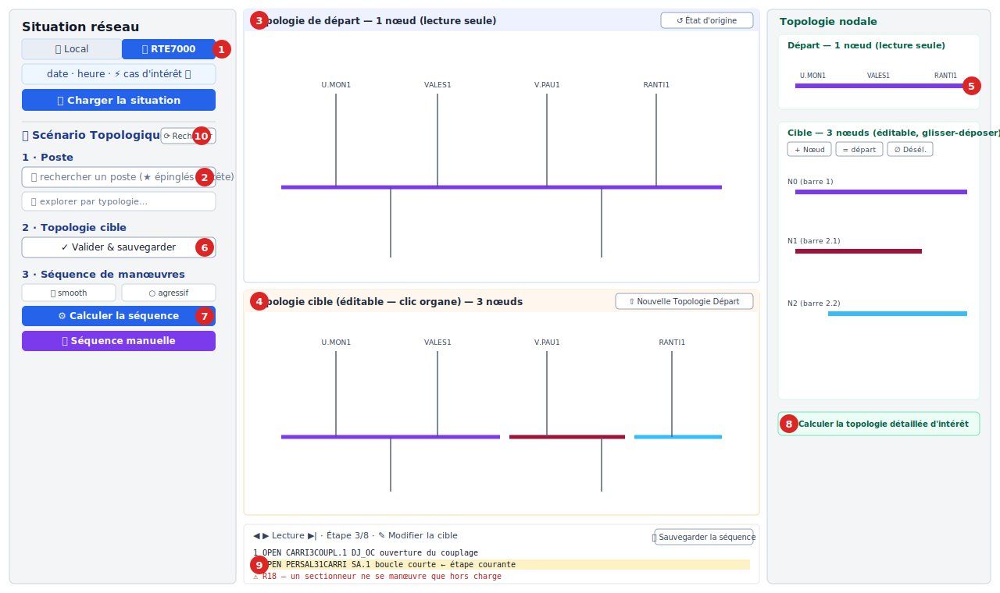

# IHM de test du module manœuvre

> Interface web légère pour **tester interactivement** le module
> `expert_op4grid_recommender.manoeuvre` sur les postes de test : éditer une
> topologie détaillée cible, calculer la séquence de manœuvres, l'animer sur le
> schéma unifilaire, et **sauvegarder scénarios et séquences** pour l'analyse et
> la création de tests.

Script : `scripts/manoeuvre_ihm.py` — Règles métier : `docs/manoeuvre_regles.md`.

---

## 1. Installation et lancement

L'IHM repose sur **Flask** (dépendance **optionnelle**) :

```bash
pip install -e ".[ihm]"        # guillemets requis sous zsh ; ou : pip install flask
```

Lancement :

```bash
python scripts/manoeuvre_ihm.py --grid /chemin/vers/grid.xiidm
# puis ouvrir http://localhost:8000
```

| Argument | Défaut | Rôle |
|----------|--------|------|
| `--grid` | *(optionnel)* | Réseau `.xiidm` local. **Omis ⇒ mode dataset** (cf. § 1bis) |
| `--host` | `127.0.0.1` (env `HOST`) | Interface d'écoute (`0.0.0.0` en conteneur / Space) |
| `--port` | `8000` (env `PORT`) | Port HTTP |
| `--scenarios-dir` | `tests/manoeuvre/scenarios` | Dossier de sauvegarde des **scénarios** (cibles) |
| `--sequences-dir` | `tests/manoeuvre/sequences` | Dossier de sauvegarde des **séquences** générées |
| `--dataset` | — | Activer la **source dataset RTE 7000** (défaut si `--grid` absent) |
| `--dataset-repo` | `OpenSynth/D-GITT-RTE7000-2021` (env `DGITT_REPO`) | Dataset HuggingFace source (repo **base** ; l'année d'une date d'accès rapide sélectionne `…-2021/-2022/-2023`) |
| `--cache-dir` | `.cache/dgitt` (env `DGITT_CACHE_DIR`) | Cache local des instantanés téléchargés |
| `--default-date` | `2021-01-03` (env `DGITT_DEFAULT_DATE`) | Date proposée par défaut dans l'IHM |

> Le serveur charge le réseau une fois (≈ 15 s pour un grand `.xiidm`) puis
> affiche les postes de test disponibles. Il est **mono-utilisateur** et
> **mono-thread** (l'état réseau pypowsybl est partagé).

**Postes de test** (intersection des fixtures et du réseau) : CARRIP3, CARRIP6,
CZTRYP6, COMPIP3, BXTO5P3, BXTO5P6, CZBEVP3, PALUNP3, NOVIOP3, SSAVOP3, VIELMP6,
CORNIP3, GUARBP6, MORBRP6.

---

## 1bis. Mode dataset RTE 7000 + déploiement HuggingFace

Sans `--grid`, l'IHM démarre en **mode dataset** : au lieu d'un réseau local
figé, elle source les situations dans le dataset HuggingFace
[`OpenSynth/D-GITT-RTE7000-{2021,2022,2023}`](https://huggingface.co/datasets/OpenSynth/D-GITT-RTE7000-2021)
(réseau France, **un instantané XIIDM toutes les 5 min**), **téléchargés à la
demande** (rien n'est embarqué). C'est le mode utilisé par le HuggingFace Space.
Le dataset existe **par année** ; l'**année** d'une date sélectionne
automatiquement le repo (`…-2021` / `…-2022` / `…-2023`, cf.
`dataset_source.repo_pour_date`), de sorte que les 7 journées d'accès rapide
(2021-2023, « Table de campagne ») fonctionnent toutes.

```bash
pip install flask pypowsybl networkx pandas      # dépendances de l'IHM dataset
python scripts/manoeuvre_ihm.py --dataset        # http://localhost:8000
```

Déroulé dans l'IHM (bandeau **📅 Dataset RTE7000** en tête de barre latérale) :

1. choisir une **date** (accès rapides vers des journées documentées) puis une
   **heure** — menu des instantanés disponibles, **midi présélectionné** ;
2. **Charger la situation** → le réseau France de cette date/heure est téléchargé
   puis chargé ; **tous les voltage levels** (postes NODE_BREAKER) se peuplent ;
3. sélectionner un poste → sa **topologie détaillée** s'affiche (suite du flux
   habituel : éditer la cible, séquencer, animer). Changer de date/heure recharge
   la situation **en préservant le poste courant** s'il existe encore.

La couche de sourcing est `manoeuvre/dataset/source.py` (`lister_instantanes`,
`choisir_instantane`, `charger_situation` — stdlib pur, cache + md5, jeton
`HF_TOKEN` optionnel). Le **réseau France complet** (~5 900 postes NODE_BREAKER)
se charge en quelques secondes au premier choix d'une date ; les changements de
poste à date constante sont quasi instantanés.

**Déploiement HuggingFace Docker Space** : `Dockerfile` (mono-conteneur Flask sur
`:7860`, mode dataset) + `deploy/huggingface/` (README du Space + `SETUP.md`
détaillé) + `.github/workflows/deploy-huggingface.yml` (redéploiement auto sur
merge `main`, inerte tant que `HF_TOKEN`/`HF_SPACE` ne sont pas définis). Voir
`deploy/huggingface/SETUP.md`.

---

## 1ter. Explorer la journée — carte des postes localisés

Sous l'onglet **📅 RTE7000**, après le choix d'une **date**, le bouton **🗺
Explorer la journée** ouvre une **carte du réseau France** dans l'espace de
visualisation (à la place des schémas de poste), pour repérer d'un coup d'œil les
postes **intéressants** d'une journée.

**Estimation de l'intérêt** — trois situations sont chargées : **minuit (00:00)**,
**midi (12:00)** et **23 h** (l'instantané le plus proche de chaque heure). Pour
chaque poste, on compte le **nombre d'organes de coupure (OC) dont l'état change**
sur la journée (un OC dont l'état n'est pas constant sur les trois instantanés),
**ventilé par type d'OC** : `BREAKER` (disjoncteur), `DISCONNECTOR` (sectionneur),
`LOAD_BREAK_SWITCH` (interrupteur). Le **classement et la mise en évidence sont au
niveau voltage level** (granularité fine, pas par site) : le panneau latéral droit
liste les **VL les plus actifs** (cliquable) et les **10 premiers VL** sont mis en
évidence sur la carte (halo doré + rang sur le poste correspondant). Cœur de
calcul : `manoeuvre/dataset/exploration.py` (`changements_par_vl` — Python pur).

**Carte** — chaque poste (substation) est un **disque coloré par niveau de
tension** (palette type RTE : 400 kV rouge, 225 kV vert…), sur un **fond** qui
détoure la France (enveloppe convexe du réseau, « Hexagone »). Coordonnées du
**plan de masse RTE** (planaire) ; sources lon/lat projetées **Web Mercator** côté
serveur. Un **sélecteur d'heure** (en-tête de la carte : 00 h / 12 h / 23 h) choisit
l'heure de la topologie ouverte au double-clic. Carte **autonome** (SVG,
sans tuiles ni librairie externe) avec **zoom molette** et **déplacement au
glisser** (manipulation du `viewBox`, fluide jusqu'à ~6 000 postes). Interactions :

- **clic** sur un disque → **bulle d'information** (nom, tension, total d'OC
  changés + ventilation par type, détail par voltage level, rang) ;
- **double-clic** (ou bouton de la bulle) → bascule en **vue topologique** du
  poste à l'heure visée, avec une **barre d'exploration** : boutons **Départ**
  (00 h / 12 h / 23 h) pour choisir la **topologie de départ** souhaitée, boutons
  **Retenir comme cible** (00 h / 12 h / 23 h) pour fixer la **cible** = topologie
  du poste à cette heure (**ensuite éditable** comme n'importe quelle cible), et un
  sélecteur de **niveau de tension** si le poste en a plusieurs. L'**heure** (menu
  de la colonne de gauche) et le **champ du poste ciblé** sont mis à jour.

**Coordonnées des postes** — le dataset RTE 7000 ne porte **pas** de coordonnées
géographiques (pas d'extension `substationPosition`). Elles sont résolues par une
**chaîne de sources** (`manoeuvre/dataset/geographie`) :

1. **Plan de masse RTE committé** (`manoeuvre/dataset/grid_layout_rte.json`,
   `{nom_VL: [x, y]}`) — **source primaire, hors-ligne** : ~**98 %** des postes,
   **aucun accès réseau**, fonctionne **immédiatement** (rien à configurer).
   `positions_from_layout` agrège par poste (VL de plus haute tension).
2. **Instantané committé** `data/postes_rte_geo.json` (indexé par `substation_id`).
3. **OpenStreetMap / Overpass** (`overpass-api.de`) — repli runtime : les postes
   RTE y sont taggués `power=substation` + **`ref:FR:RTE` = `substation_id`**
   (mnémonique RTE), avec lat/lon. Apparié à la volée ; le résultat est **persisté**
   (`data/postes_rte_geo.json`) puis **téléchargeable** (bouton **⬇ coordonnées**)
   pour le committer. `MANOEUVRE_ENABLE_OSM=0` désactive le fetch.

Le plan de masse couvrant la quasi-totalité des postes, la carte s'affiche
**sans configuration ni accès réseau** ; l'en-tête indique la source et la
couverture (`coord. : layout (4723/4811, 98%)`). ODRE
([`postes-electriques-rte`](https://odre.opendatasoft.com/explore/dataset/postes-electriques-rte/))
est **purement tabulaire** (code, nom, tension, département — **sans géométrie**,
vérifié via l'API records) : inutilisable pour la carte.

Les coordonnées du plan de masse sont une **projection planaire RTE** (utilisée
telle quelle ; les sources lon/lat sont projetées en Web Mercator côté serveur) —
la carte n'a pas besoin de lon/lat vrais, seulement de positions relatives
cohérentes.

Si **aucune** coordonnée n'est résolue (plan absent *et* OSM bloqué), la carte est
masquée et l'IHM reste utile : le **classement** des postes les plus actifs
s'affiche en liste (cliquable pour ouvrir la topologie) ; un **diagnostic** dans
le bandeau indique la cause (OSM injoignable, ou joignable mais 0 apparié avec des
échantillons de codes).

---

## 2. Disposition de l'interface



> **Fig. — L'environnement interactif de manœuvre sur un scénario de scission de
> nœud à CARRIP3** (départ : un nœud électrique ; cible : trois nœuds — barre 1
> conservée, barre 2 scindée en sections 2.1 et 2.2). Repères :
> **(1)** la source **Situation réseau**, en **deux onglets** — *📁 Local*
> (chemin `.xiidm` côté serveur + **sélecteur de fichier natif**) et *📅 RTE7000*
> (date/heure du dataset RTE-7000, avec **puces « cas d'intérêt »** et bulles
> d'information) — chargée par un **unique bouton Charger** (RTE7000 mis en avant
> par défaut sur le Space hébergé) ;
> **(2)** le champ **Poste unifié** — une **seule recherche** sur tous les postes
> NODE_BREAKER (postes épinglés ★ repérés dans les résultats) et, en dessous,
> l'**exploration curée par typologie** ;
> **(3)** le schéma unifilaire **de départ** (lecture seule, état de référence),
> dont l'en-tête porte **↺ État d'origine** (réinitialise la cible à l'état
> d'origine) ;
> **(4)** le schéma **cible éditable** — clic sur un disjoncteur/sectionneur pour
> le basculer — dont l'en-tête porte **⇧ Nouvelle Topologie Départ** (promeut la
> **cible courante (éditée)** en nouveau départ, pour chaîner les scénarios) ;
> **(5)** la « **vue bus** » nodale — glisser un départ sur une barre =
> ré-aiguillage, glisser une barre sur une autre = fusion, *+ Nœud* = créer un
> nœud — en partition de départ (un nœud, lecture seule) et cible (trois nœuds,
> éditable) ;
> **(6)** *2 · Topologie cible* : **✓ Valider** la cible (active « Calculer », sans
> écrire de fichier) puis, sur la ligne en dessous, le **nom** + **💾 Sauvegarder**
> (sur le Space, le fichier est aussi **téléchargé en local**) ;
> **(7)** *3 · Séquence de manœuvres* : choisir un mode de dé-énergisation
> (smooth/agressif) et un algorithme, puis **⚙ Calculer** ou construire à la main
> (**✋ Séquence manuelle**) la séquence ;
> **(8)** **⚙ Calculer la topologie détaillée d'intérêt** réalise la cible nodale
> éditée en cible détaillée (le **pont nodal → détaillé**) ;
> **(9)** la séquence, **animée pas à pas** avec l'étape courante surlignée et les
> opérations auditées — un sectionneur manœuvré **sous charge** est signalé en
> **rouge** avec la règle enfreinte (ici **R18**, invariant hors-charge) — plus
> l'export **💾 Sauvegarder la séquence** ;
> **(10)** **⟳ Recharger** (à droite du titre *🗺 Scénario Topologique*) ouvre une
> petite **modale** (sélecteur de scénario + Valider/Annuler) pour **rejouer** un
> scénario sauvegardé.
> Les couleurs des barres sont le `topological_coloring` natif des schémas
> NODE_BREAKER ; à droite, les barres **violette**, **bordeaux** et **bleu clair**
> sont les trois nœuds cibles (barre 1, et barre 2 scindée en 2.1 et 2.2).

> La figure ci-dessus est un **schéma annoté** (SVG versionné) de la disposition ;
> structure équivalente en ASCII :

```
┌──────────────────────┬─────────────────────────────────┬────────────────────┐
│ PANNEAU LATÉRAL      │ SCHÉMA — TOPOLOGIE DE DÉPART     │ VOLET NODAL        │
│ Situation réseau     │ (SLD pypowsybl)  [↺ État d'orig.]│                    │
│  [📁 Local|📅 RTE7000]├─────────────────────────────────┤ Topo nodale DÉPART │
│  ⏬ Charger (unique)  │ SCHÉMA — TOPOLOGIE CIBLE        │ (lecture seule)    │
│ 🗺 Scénario Topo.     │ [⇧ Nouvelle Topologie Départ]   ├────────────────────┤
│  1 · Poste (recherche)│ clic organe = bascule ; anim.  │ Topo nodale CIBLE  │
│  2 · Topologie cible  ├─────────────────────────────────┤ (éditable : chips) │
│  3 · Séquence         │ Contrôles ◀ ▶ Lecture ▶|        │ ⚙ Calculer la      │
│ • Scénarios · Nœuds   │ Séquence (texte) + 💾           │ topo détaillée     │
└──────────────────────┴─────────────────────────────────┴────────────────────┘
```

- **Situation réseau** (haut du panneau) : **deux onglets** — **📁 Local**
  (chemin `.xiidm` côté serveur + bouton **📂** de sélection native, usage local)
  et **📅 RTE7000** (date / heure du dataset, avec **puces d'accès rapide** vers
  les journées « cas d'intérêt » documentées, chacune avec sa **bulle**
  d'explication) — et un **unique bouton ⏬ Charger** qui agit sur l'onglet actif.
  L'onglet **RTE7000 est mis en avant par défaut** sur le HuggingFace Space (mode
  dataset) ; **Local** par défaut en usage local.
- **Scénario Topologique** : la suite de travail en **trois étapes** —
  **1 · Poste** (champ de recherche **unique** sur tous les postes + liste
  browsable curée **par typologie** en dessous), **2 · Topologie cible** (éditer
  + valider), **3 · Séquence de manœuvres**.
- **Schéma de départ** (centre haut, bandeau bleu) : topologie détaillée
  initiale, **non modifiable** ; sert de référence. Son en-tête porte le bouton
  **↺ État d'origine** (réinitialise la cible à l'état d'origine du poste).
- **Schéma cible** (centre bas, bandeau orange) : topologie détaillée
  **éditable** ; c'est aussi là que se déroule l'animation de la séquence. Son
  en-tête porte le bouton **⇧ Nouvelle Topologie Départ** (la **cible courante
  éditée** devient le nouvel état de départ — `/api/promote_cible` ; le schéma de
  départ ci-dessus est mis à jour).
- **Volet nodal** (droite) : représentation **schématique en « vue bus »** (un
  **nœud** = barre horizontale colorée ; chaque **branche** = départ vertical
  portant son **libellé** détaillé et sa **valeur de flux** en MW) de la topologie
  nodale de départ et d'une **cible nodale éditable par glisser-déposer**. Voir §3
  *Éditer une topologie nodale cible*. Le volet entier est repliable via ◂, et
  ses sections **Départ** et **Cible** sont **repliables indépendamment** (bouton
  **▾ / ▸** dans leur en-tête — replier l'une donne tout l'espace à l'autre).
- Le **nombre de nœuds électriques** est affiché par schéma et se met à jour à
  chaque modification.
- Chaque en-tête porte un bouton **▾ / ▸** pour **replier** son schéma : l'autre
  schéma occupe alors tout l'espace. Utile sur les grands postes pour observer
  l'animation de la séquence en plein écran sur la cible.

Les **couleurs** sont celles de pypowsybl (`topological_coloring`) : couleur de
base par niveau de tension (≈ violet pour le 63 kV), déclinée en teintes
distinctes par nœud électrique. Le navigateur rend nativement le SVG (résolution
des variables CSS).

---

## 3. Flux de travail

1. **Choisir un poste** (étape *1 · Poste* du Scénario Topologique). **Aucun poste
   n'est chargé automatiquement** (au lancement ni au chargement d'une situation) :
   les schémas restent sur « Choisissez un poste… » tant qu'on n'en a pas
   sélectionné un — alors les deux schémas affichent son état de départ (pristine).
   Un **unique champ** réunit deux modes dans une même interaction : une
   **recherche** sur **tous** les postes NODE_BREAKER de la situation et, **en
   dessous** (sous le titre **« Pré-sélection de postes typiques »**), une **liste
   browsable**. Champ **vide** → exploration **curée par typologie** (sections :
   *≥5 jeux de barres*, *sectionnement extrême*, *faisceau de couplage partagé*,
   *organes internes*, *omnibus*, *départs déconnectés*, *gros postes*, …). En
   **saisissant**, la liste filtre en **recherche plein-texte** sur tous les
   postes (bornée à 300 résultats affichés ; les postes épinglés ★ — jeu de test
   + 7 postes 3 JdB — y sont marqués). Un poste **grisé** (⚠ absent) n'est pas
   présent dans la situation chargée → charger la grille France (`grid.xiidm`)
   pour y accéder (le rendu détaillé SLD requiert le réseau).
2. **Éditer la cible** : cliquer un disjoncteur/sectionneur dans le schéma du
   bas pour basculer son état (ouvert/fermé). Le nombre de nœuds cible évolue en
   direct.
3. **Valider la cible** (étape *2 · Topologie cible*) : le bouton **✓ Valider**
   débloque le calcul de séquence **sans écrire de fichier**. Pour la conserver,
   **💾 Sauvegarder** (champ nom à gauche, bouton à droite) persiste le scénario
   (départ + cible) ; **sur une IHM déportée (Space)** le JSON est aussi
   **téléchargé en local** (le FS du Space est éphémère). Sauvegarder valide
   aussi la cible.
4. **Calculer la séquence** (étape 2, débloqué après validation) : choisir le
   **mode** (Smooth, défaut, ou Agressif) puis lancer le calcul départ → cible ;
   statut **VÉRIFIÉE / NON VÉRIFIÉE** (+ badge `mode`).
   - **Smooth** : **un seul ouvrage hors tension à la fois** — chaque branche
     est garée (ré-aiguillée) une par une sur une autre section avant d'ouvrir le
     sectionneur ; séquence plus longue mais douce.
   - **Agressif** : dé-énergise en lot (moins de manœuvres, mais plusieurs
     ouvrages momentanément hors tension simultanément).
5. **Lire / animer** : la séquence s'affiche en texte ; les contrôles
   d'animation rejouent les manœuvres une par une sur le schéma cible, l'organe
   manœuvré **surligné en rouge**, la ligne de séquence courante surlignée.
6. **Sauvegarder la séquence** : 💾 écrit un JSON autonome (topologies +
   séquence + lien scénario) pour l'analyse et les tests. Si le fichier existe
   déjà, une **confirmation** est demandée (écraser) ou un **nouveau nom** est
   proposé (idem pour la sauvegarde de scénario).

> La cible éditée étant une **topologie détaillée** (barre exacte de chaque
> départ), l'IHM vise cet état exact : après avoir atteint la partition nodale,
> les départs sont ramenés sur leur barre imposée (manœuvres supplémentaires),
> et la **topologie détaillée est vérifiée**. Le statut affiche
> « DÉTAILLÉE VÉRIFIÉE », ou « NODALE OK · N écart(s) détaillé(s) » avec la
> liste des écarts résiduels.

### Éditer une topologie nodale cible (étape intermédiaire)
Plutôt que de basculer les organes un à un, l'expert peut raisonner au niveau
**nodal** (quelles branches sur quel nœud électrique) dans le **volet de droite**,
puis demander un **calcul de la topologie détaillée d'intérêt** réalisant cette
partition. Le pont nodal → détaillé passe par la **façade pluggable**
(`manoeuvre.plugins.PlanificateurTopologie.identifier_topologie_detaillee`,
phase A) avec l'**algorithme sélectionné** dans le volet — « libtopo » par
défaut (qui délègue à `determiner_topo_complete_cible(poste, topo_cible)`).

- **Représentation** : rendu **schématique en SVG, en « vue bus »** comparable au
  schéma détaillé. Chaque nœud électrique est une **barre horizontale** dont la
  **couleur est celle utilisée par la vue détaillée** (`topological_coloring` du
  SLD : même nœud électrique ⇒ même couleur), repérée par un badge `N0`, `N1`… Ses
  branches sont des **départs verticaux** — *du haut* au-dessus de la barre, *du
  bas* en dessous, comme dans la vue détaillée — **triés de gauche à droite** par
  leur abscisse SLD. Chaque branche porte son **libellé** (extrait du SLD, donc
  **strictement identique** au schéma détaillé : `C.REG1`, `AT762`, `TR634`…) et sa
  **valeur de flux** (P en MW, état de départ). Les nœuds sont **empilés
  verticalement**. Le volet montre la topologie nodale de **départ** (lecture
  seule) et une **cible nodale éditable** initialisée **avec la topologie de départ**.
- **Élargir le volet** : un **séparateur déplaçable** (entre le schéma détaillé et
  le volet nodal) permet d'élargir la 3ᵉ colonne en réduisant la 2ᵉ, afin
  d'afficher tous les nœuds de la partition dans la largeur.

L'édition se fait par **glisser-déposer** :
- **Réaiguiller des départs** : glisser une branche sur une autre barre l'y
  déplace. Pour en déplacer plusieurs d'un coup, **cliquer** d'abord les branches
  voulues (sélection surlignée, inter-nœuds) puis glisser l'une d'elles.
- **Fusionner des nœuds** : glisser une **barre** sur une autre barre (fusion).
- **Créer un nœud** : bouton **＋ Nœud**. Avec une sélection, il y déplace les
  départs sélectionnés ; **sans sélection, il crée un nœud vide qui persiste**
  comme cible de dépose — glisser-y ensuite des départs. Un nœud resté **vide**
  est **ignoré** au calcul de la topologie détaillée (et retiré de l'affichage à
  ce moment-là).
- **Réinitialiser** : **↺ Réinitialiser** ramène la cible à la topologie
  d'origine du poste (**détaillée + nodale** = départ, via `/api/reset`) ;
  **∅ Désélectionner** vide la sélection.

Les **ouvrages déconnectés** (organe ouvert → non raccordés à une barre) ne sont
**pas** des nœuds électriques : ils sont listés à part, en **tête de chaque
cadre** (chips **⚠ Ouvrages isolés**, première ligne sous le titre de section),
**individuellement sélectionnables** (clic) et **glissables**, et n'occupent pas
d'espace en barre. Pour en **reconnecter** un, le **glisser sur une barre** (il
rejoint ce nœud) ; côté serveur, les isolés restants sont **laissés déconnectés**
(hors partition cible).
Le compteur de nœuds exclut les isolés.
- **⚙ Calculer la topologie détaillée d'intérêt** : envoie la partition nodale
  (`/api/nodale_to_detaillee`) ; l'IHM **charge l'état détaillé réalisant** cette
  cible dans le schéma du bas (devient la nouvelle cible détaillée, à **valider**
  avant calcul de séquence). Le statut indique **✓** si la cible nodale est
  intégralement réalisable, ou un message de **réalisation partielle** (nœuds non
  réalisables, écarts) en cas de dégradation gracieuse de l'algorithme.
  Le volet nodal cible est alors **resynchronisé sur la topologie réalisée**
  (partition, **couleurs** topological_coloring et ouvrages isolés renvoyés dans
  `nodale` par `/api/nodale_to_detaillee`) : il prend les mêmes nœuds et couleurs
  que le schéma détaillé obtenu.

> Les nœuds vides sont automatiquement retirés et la partition renumérotée
> `N0…Nk` après chaque opération ; le nombre de nœuds cible est affiché en direct.

**Synchronisation détaillé ↔ nodal.** La topologie **détaillée** fait foi : le
volet nodal cible **reflète** la partition de l'état détaillé courant. Toute
**édition du détail** (bascule d'un organe, `↺ État d'origine`) **ou rechargement
de scénario** (modale **⟳ Recharger**) **resynchronise** la cible nodale (partition, couleurs,
ouvrages isolés) — par ex. ouvrir le DJ d'un départ le fait passer en *ouvrage
isolé* dans le volet nodal, et recharger un scénario à N nœuds affiche bien ces N
nœuds côté nodal. Le
glisser-déposer nodal (et **＋ Nœud**) sont des **propositions** de partition
(le détail n'est pas encore modifié) ; **⚙ Calculer…** les réalise, charge la
cible détaillée et resynchronise le volet nodal sur la topologie **obtenue**
(d'où, en cas de réalisation partielle, un volet nodal qui correspond bien au
détail réalisé et non à la proposition).

### Naviguer et éditer la séquence (expert)
La séquence calculée peut être **parcourue et modifiée** directement, sans avoir
à balayer toutes les étapes :

- **Aller à un état** : cliquer une **ligne** de la séquence (ou l'en-tête
  « État de départ ») saute directement à cet état sur le schéma.
- **Ajouter une manœuvre** : à l'étape affichée, le schéma cible **redevient
  interactif** ; cliquer un organe **insère** une manœuvre (bascule de l'organe)
  **juste après** l'étape courante — la suite de la séquence est **conservée**.
  Les manœuvres ajoutées sont libellées « manœuvre manuelle (expert) »
  (affichées en violet).
- **Supprimer une manœuvre** : bouton **✕** au survol d'une ligne.
- **Supprimer plusieurs manœuvres / un bloc** : **cocher** les cases des lignes
  voulues (**Maj+clic** sur une case sélectionne un **bloc** contigu), puis
  **🗑 Supprimer la sélection**.
- Après toute édition, le statut passe à **ÉDITÉE · N nœud(s)** avec un
  indicateur **= cible** / **≠ cible** (l'état nodal final est recalculé). La
  **sauvegarde** de séquence enregistre alors la liste **éditée telle quelle**
  (aucun re-calcul de l'algorithme).

### Re-éditer la cible détaillée après calcul
Une séquence calculée met le schéma du bas en mode **animation** (clic = insertion
de manœuvre). Pour **revenir éditer la cible détaillée** sans repartir de zéro, le
bouton **✎ Modifier la cible** (barre d'animation) bascule le schéma en mode
**édition** : les contrôles d'animation sont désactivés et chaque clic sur un
organe modifie de nouveau la cible. Dès qu'un organe est modifié, un **bandeau
rouge** signale que *« la séquence ci-dessous n'atteint plus cet état cible »* et
la liste de séquence est grisée. Il faut alors **re-valider** la cible puis
**recalculer la séquence** (qui efface l'obsolescence). Le bouton **▶ Revenir à la
séquence** ré-affiche l'animation de la séquence (obsolète) sans rien recalculer.

### Construire une séquence **entièrement manuelle**
Une fois la cible **validée**, le bouton **✋ Séquence manuelle** démarre une
séquence **vierge** : l'expert la construit lui-même, organe par organe.
- Le schéma **du bas** part de l'**état de départ** et est **interactif** :
  chaque clic sur un organe **ajoute une manœuvre** (bascule depuis l'état
  courant) et fait avancer la vue d'un cran.
- Le schéma **du haut** affiche la **cible à atteindre** (référence statique).
- Le statut indique **MANUELLE · N nœud(s)** avec **= cible** / **≠ cible** ;
  on suit ainsi la convergence vers la topologie visée.
- Navigation (clic sur une ligne), suppression (✕ / sélection multiple) et
  **sauvegarde** fonctionnent comme pour une séquence calculée.

### Mise en évidence « topologie cible atteinte »
Dès que l'**état affiché** (animation automatique **ou** construction manuelle)
**est** la topologie **cible** — même partition nodale —, la vue du poste (bas)
est **encadrée d'un halo jaune** et le bandeau affiche « ✓ topologie cible
atteinte ». L'indicateur est recalculé **à chaque étape** côté serveur
(`step_view` renvoie `reached = meme_topologie(état affiché, cible)`), de sorte
qu'il s'allume exactement lorsque la cible est atteinte et s'éteint sinon.

### Réutiliser des scénarios
- **⟳ Recharger** (bouton à droite du titre *🗺 Scénario Topologique*) : ouvre une
  **petite modale** (sélecteur de scénario + **Valider** / **Annuler**) qui
  **rejoue** le scénario choisi (départ **et** cible sauvegardés). Remplace
  l'ancienne section « Scénarios sauvegardés ».
- **⇧ Nouvelle Topologie Départ** (en-tête du schéma cible) : la **cible courante
  (éditée)** devient le **nouvel état de départ** (`/api/promote_cible`, **sans**
  passer par un scénario sauvegardé) — le schéma de départ ci-dessus est mis à
  jour. Permet de **chaîner** (repartir d'une topologie validée plutôt que de
  l'état de base du réseau), puis d'éditer une nouvelle cible par-dessus.

---

## 4. API HTTP

Toutes les réponses sont en JSON. Le SVG est renvoyé en ligne (rendu par le
navigateur).

| Méthode & route | Corps | Réponse | Rôle |
|-----------------|-------|---------|------|
| `GET /` | — | HTML | Page de l'IHM |
| `GET /api/postes` | — | `{postes:[…], all:[…], catalog:[…]}` | `postes` = liste **épinglée** (jeu de test + 7 postes 400 kV à **3 jeux de barres** identifiés) ; `all` = **tous** les postes NODE_BREAKER de la situation (champ de recherche) ; `catalog` = **sections par typologie** (cf. ci-dessous). En mode dataset avant tout chargement : `{postes:[], all:[], catalog:[], needs_date:true}` |
| `GET /api/dataset/config` | — | `{enabled, repo, default_date, default_time, sample_dates[], hosted}` | Config de la source dataset (onglet **RTE7000**) ; `enabled` décide de l'**onglet actif par défaut** (RTE7000 sur le Space, Local en mode `--grid`) ; `hosted` = IHM déportée → le front **télécharge en local** les fichiers sauvegardés |
| `GET /api/dataset/timestamps?date=YYYY-MM-DD` | — | `{ok, date, timestamps:[{ts,path}], default}` / `400` (date invalide) / `502` (HF) | Instantanés disponibles pour la journée (HH:MM), avec l'horodatage présélectionné (le plus proche de **midi**) |
| `POST /api/dataset/load` | `{date, time}` | `{ok, date, time, iso, postes:[…], all:[…], catalog:[…]}` / `400` (absent) / `502` (HF) | **Télécharge à la demande** l'instantané `(date, time)` du dataset, reconstruit la session et liste les postes (même forme que `/api/load_grid`) |
| `POST /api/explore_day` | `{date}` | `{ok, date, heures[], coord_source, coord_stats, coord_file, n_postes, n_actifs, n_geolocalises, types_oc[], postes:[{sub,name,nv,x,y,total,BREAKER,DISCONNECTOR,LOAD_BREAK_SWITCH,rank,top_vl,vls[]}], classement:[…]}` / `400` / `502` | **Explorer la journée** : charge 3 situations (minuit/midi/23 h), compte par poste les **OC changés** (par type), résout les coordonnées (**plan de masse committé** en primaire, repli OSM) et reconstruit la session. `postes` = postes **géolocalisés** (carte ; `x,y` = coords planaires **prêtes pour l'écran**) ; `classement` = top **actifs** (liste) ; `coord_source ∈ {layout, xiidm, snapshot, osm, aucune}` ; `coord_file` = un instantané committable a été persisté (source osm) |
| `GET /api/explore_coords_file` | — | `postes_rte_geo.json` (pièce jointe) / `404` | Télécharge l'instantané de coordonnées **résolu/persisté** au runtime — à **committer** (`data/postes_rte_geo.json`) pour éviter de ré-interroger ODRE à chaque démarrage (FS du Space éphémère) |
| `POST /api/explore_poste` | `{sub?, vl?, hour}` | `{ok, initial_svg, nb_initial, svg, switches, nb_noeuds, vl, sub, hour, heures[], sub_vls[], nodale_depart, nodale_cible}` / `400` | Bascule en **vue topologique** d'un poste à une **heure** de la journée explorée (applique les états de l'heure sur le réseau de référence) ; `vl` explicite ou **VL le plus actif** de la `sub` |
| `POST /api/explore_retain_target` | `{vl?, hour}` | `{ok, svg, switches, nb_noeuds, hour, nodale}` / `400` | **Retient** la topologie du poste à `hour` comme **cible** courante (puis éditable) |
| `POST /api/load_grid` | `{path}` | `{ok, postes:[…], all:[…], catalog:[…]}` / `400 {ok:false, error}` | Charge **dynamiquement** une autre situation réseau `.xiidm` (chemin **côté serveur**) et réinitialise la session ; 400 propre si fichier introuvable/illisible (session inchangée) |
| `GET /api/pick_grid_file` | — | `{path, error?}` | Ouvre un **sélecteur de fichier natif** (onglet *Local*, usage local) pour choisir une situation `.xiidm` ; `path` vide si annulé ; `error` si headless / tkinter absent (l'IHM invite à coller le chemin) |
| `POST /api/load` | `{vl}` | `{initial_svg, nb_initial, svg, switches, nb_noeuds, nodale_depart, nodale_cible}` | Charge un poste (départ pristine) — **n'importe quel** VL NODE_BREAKER ; inclut les partitions nodales |
| `POST /api/toggle` | `{id}` | `{svg, switches, nb_noeuds, nodale}` | Bascule un OC (cible) ; `nodale` = vue nodale resynchronisée |
| `POST /api/reset` | — | `{svg, switches, nb_noeuds, nodale}` | Réinitialise la cible = départ |
| `POST /api/promote_cible` | — | `{initial_svg, nb_initial, svg, switches, nb_noeuds, vl, nodale_depart, nodale_cible}` | **Promeut la cible courante en nouvel état de départ** (chaînage sans scénario sauvegardé) ; met à jour les deux schémas + vues nodales |
| `POST /api/cible` | — | `{svg, switches, nb_noeuds, nodale}` | Vue de la cible détaillée **courante** (sans la modifier) — pour revenir l'éditer alors qu'une séquence est calculée |
| `POST /api/nodale` | — | `{nodale_depart, nodale_cible}` | Partitions nodales (cible initialisée = départ) ; `nodale_*` = `{groups[[…]], labels{id:nom}, types{id:type}, flows{id:MW}, dirs{id:TOP\|BOTTOM}, order{id:x}, colors{id:#hex}, isolated[…]}`. `labels`/`dirs`/`order`/`colors` sont **extraits du SLD** (libellés, côté, ordre horizontal et **couleur du nœud `topological_coloring`** identiques à la vue détaillée) ; `flows` provient d'une charge de réseau ; `isolated` liste les départs **déconnectés** (composante sans barre) |
| `POST /api/nodale_to_detaillee` | `{groups, isolated?}` | `{svg, switches, nb_noeuds, is_verified, message, ecarts[], noeuds_non_realisables[[…]], nb_obtenu, nb_vise, nodale}` | Calcule la **topologie détaillée d'intérêt** réalisant la cible nodale `groups` (les `isolated` sont laissés hors partition) et la charge comme cible détaillée ; `nodale` = `{groups, colors, isolated}` de la topologie **réalisée** (resynchronise le volet nodal) |
| `POST /api/sequence` | `{mode?}` | `{verified, verified_detaillee, ecarts[], alertes[], message, nb_manoeuvres, manoeuvres[], n_steps, labels[], nb_final, matches_cible, edited, mode}` | Calcule la séquence (cible **détaillée**) ; `mode` = `"smooth"` (défaut) ou `"aggressive"` ; `alertes` = **bonne pratique non bloquante** (R10ter : > 1 ouvrage ré-aiguillé hors tension à la fois, mode smooth), affichée en badge ⚠ |
| `GET /api/step?i=k` | — | `{svg, switches[], nb_noeuds, i, reached, nodale}` | Image d'animation de l'étape *k* (surlignée) **+ organes cliquables** ; `reached` = l'état affiché est la topologie cible ; `nodale` = **partition nodale de l'état détaillé de l'étape** (`{groups, colors, isolated}`) → le volet nodal **suit l'étape** (départ → … → cible) ; `null` si aucune séquence |
| `POST /api/seq_insert` | `{step, id}` | `{goto, manoeuvres[], n_steps, labels[], nb_final, matches_cible, edited}` | Insère une manœuvre basculant `id` **après** l'étape `step` (conserve la suite) |
| `POST /api/seq_delete` | `{index}` | idem `seq_insert` | Supprime la manœuvre n°`index` (1-based) |
| `POST /api/seq_delete_many` | `{indices:[…]}` | idem `seq_insert` | Supprime en une fois plusieurs manœuvres (sélection / bloc) |
| `POST /api/manual_start` | — | `{cible_svg, cible_nb, goto, manoeuvres[], n_steps, labels[], …}` | Démarre une séquence **manuelle vierge** (départ → cible affichée en référence) |
| `GET /api/scenarios` | — | `{scenarios:[…]}` | Liste des scénarios sauvegardés |
| `POST /api/save` | `{name, overwrite?}` | `{path, name, content, scenarios[]}` ou `{exists:true, name, path}` | Sauvegarde le scénario cible ; `content` = JSON écrit (téléchargement local côté front si IHM déportée) |
| `POST /api/load_scenario` | `{name, mode}` | `{initial_svg, nb_initial, svg, switches, nb_noeuds, vl, nodale_depart, nodale_cible}` | Recharge (`mode="both"` ou `"as_depart"`) ; `nodale_cible` = vue nodale de la cible chargée |
| `POST /api/save_sequence` | `{name, overwrite?}` | `{path, name, content}` ou `{exists:true, name, path}` | Sauvegarde la séquence **courante** (éditée telle quelle) ; `content` = JSON écrit (téléchargement local côté front si IHM déportée) |

> **Avertissement d'écrasement** : sans `overwrite:true`, si le fichier existe
> déjà, `/api/save` et `/api/save_sequence` renvoient `{exists:true}` (sans
> écrire) ; l'IHM demande alors confirmation d'écrasement ou un nouveau nom.

`switches` : liste d'objets `{id, name, svgId, kind, open}` (DJ/SA), où `svgId`
est l'identifiant de l'élément dans le SVG (clic et surlignage).

---

## 5. Formats de fichiers

### Scénario (`--scenarios-dir/<nom>.json`)
Topologie cible validée, réutilisable comme cible (rejeu) ou comme départ.

```json
{
  "voltage_level_id": "CARRIP3",
  "name": "scenA",
  "depart": {"<switch_id>": false, "...": true},
  "cible":  {"<switch_id>": true,  "...": false},
  "depart_nodale": [["DEP1", "DEP2"], ["..."]],
  "cible_nodale":  [["..."], ["..."]]
}
```

### Séquence (`--sequences-dir/<nom>.json`)
Séquence **courante** (telle qu'éventuellement éditée par l'expert) + topologies
+ **lien vers le scénario**. La liste de manœuvres est sérialisée telle quelle ;
seuls l'état nodal final (`nb_final`) et sa concordance avec la cible
(`matches_cible`) sont recalculés. `edited` vaut `true` si la séquence a été
modifiée à la main (insertions / suppressions).

```json
{
  "voltage_level_id": "CARRIP3",
  "name": "seqA",
  "scenario": "scenA",
  "edited": false,
  "matches_cible": true,
  "nb_final": 2,
  "depart": {"<switch_id>": false},
  "cible":  {"<switch_id>": true},
  "depart_nodale": [["..."]],
  "cible_nodale":  [["..."]],
  "nb_manoeuvres": 1,
  "manoeuvres": [
    {"ordre": 1, "switch_id": "CARRIP3_CARRI3COUPL.1 DJ_OC",
     "action": "OPEN", "raison": "ouverture couplage de barres", "boucle": null}
  ]
}
```

> Une manœuvre **ajoutée manuellement** a pour `raison` « manœuvre manuelle
> (expert) » et `boucle: null`.

### Exploitation pour un test
Un fichier de séquence (ou de scénario) est **autonome**. Pour rejouer la cible
**détaillée** (barre exacte de chaque départ) :

```python
import pypowsybl as pp, json
from expert_op4grid_recommender.manoeuvre.graph import build_vl_graph
from expert_op4grid_recommender.manoeuvre.topologie import PosteTopologique
from expert_op4grid_recommender.manoeuvre.algo import determiner_manoeuvres_cible_detaillee

d = json.load(open("tests/manoeuvre/sequences/seqA.json"))
n = pp.network.load("…/grid.xiidm")
vl = d["voltage_level_id"]

n.update_switches(id=list(d["depart"]), open=list(d["depart"].values()))
poste = PosteTopologique.from_graph(build_vl_graph(n, vl), vl)
n.update_switches(id=list(d["cible"]),  open=list(d["cible"].values()))
cible_graph = build_vl_graph(n, vl)

res = determiner_manoeuvres_cible_detaillee(poste, cible_graph)
assert res.is_verified_detaillee     # topologie détaillée atteinte
assert res.ecarts == []
```

> Les fixtures `tests/manoeuvre/scenarios/*.json` sont rejouées **sans
> pypowsybl** (via `build_graph_from_fixture`) par
> `tests/manoeuvre/test_scenarios_sauvegardes.py`.

---

## 6. Spécifications demandées et couverture

| Spécification | Couverture |
|---------------|-----------|
| Modifier **manuellement et interactivement** l'état des DJ/SA depuis une topologie de départ | Clic sur l'organe du schéma cible → `/api/toggle` |
| **Valider** la topologie cible avant de calculer | Étape **2 · Topologie cible** : bouton **✓ Valider** (sans fichier) ; le bouton « Calculer » reste verrouillé tant que la cible n'est pas validée |
| **Télécharger** les fichiers sauvegardés quand l'IHM est déportée (Space) | `hosted` (`/api/dataset/config`) → `save()` / `saveSeq()` déclenchent un download du `content` renvoyé par `/api/save` / `/api/save_sequence` |
| **Sauvegarder** la cible pour des tests par ailleurs | Scénario JSON (`/api/save`) avec topologies détaillées + nodales |
| Demander la **séquence de manœuvres** départ → cible | `/api/sequence` → façade pluggable (`PlanificateurTopologie.sequencer`, phase B ; « libtopo » = `determiner_manoeuvres_cible_detaillee`) |
| **Choisir l'algorithme** de chaque phase de calcul (natif « libtopo » + plugins enregistrés) | Sélecteurs « Algo » (panneau Séquence = phase B ; volet nodal = phase A) ; `GET/POST /api/algos` (disponibles par phase + sélection de session) ; badge `algo <nom>` dans le statut de séquence. Les plugins tiers (registre / entry points `expert_op4grid_recommender.manoeuvre`) apparaissent automatiquement — cf. `docs/manoeuvre_plugins.md` |
| **Verdicts indépendants de l'algorithme branché** | La façade revérifie chaque résultat (`verifier_sequence` : partition, écarts détaillés, règle du sectionneur, alertes R10ter) — un plugin déclarant à tort « vérifié » est démasqué dans l'IHM |
| Affichage **textuel** de la séquence | Panneau « Séquence » |
| **Animation** sur le SLD, manœuvre par manœuvre, organe mis en évidence | Contrôles ◀ ▶ ▶| + surlignage rouge (`/api/step`) |
| **Topologie nodale qui suit l'étape** d'animation | Volet nodal « cible » rendu en lecture seule depuis `nodale` de `/api/step` (titre « Étape k/n (vue) ») ; restauré à « Cible (éditable) » à la sortie |
| Voir **départ en haut** et **cible éditable en bas** | Deux schémas empilés |
| Couleurs **natives** par niveau de tension (63 kV violet) | `topological_coloring`, rendu navigateur |
| **Explorer les postes par typologie** (sections) | Liste `#posteList` (champ vide) : une section par typologie (≥5 JdB, sectionnement extrême, faisceau partagé, organes internes, omnibus, départs déconnectés, gros postes…) ; entrées grisées = absentes de la situation (`catalog` de `/api/postes`) |
| **Recharger** une cible sauvegardée pour recalculer | « ▷ Rejouer » |
| Promouvoir la **cible courante** en nouvel état de départ | « ⇧ Nouvelle Topologie Départ » (en-tête du schéma cible) → `/api/promote_cible` (le schéma de départ est mis à jour) |
| **Recharger** un scénario (départ + cible) | Bouton « ⟳ Recharger » (titre *Scénario Topologique*) → modale (sélecteur + Valider / Annuler) → `/api/load_scenario` (mode `both`) |
| **Rechercher / explorer un poste** (champ unique) | `#posteSearch` + liste `#posteList` browsable : vide = exploration curée **par typologie** ; saisie = recherche plein-texte sur **tous** les VL NODE_BREAKER (épinglés ★ marqués dans les résultats) |
| **Sauvegarder la séquence** avec lien vers ses topologies | `/api/save_sequence` (JSON autonome + champ `scenario`) |
| Atteindre la **topologie détaillée** imposée (barre exacte) + vérification | façade `sequencer` (« libtopo » = `determiner_manoeuvres_cible_detaillee`) ; statut « DÉTAILLÉE VÉRIFIÉE » / « NODALE OK · N écart(s) » |
| **Avertissement d'écrasement** d'un fichier de sauvegarde existant | Confirmation / renommage (réponse `{exists:true}`) |
| **Replier** un schéma pour agrandir l'autre (grands postes) | Bouton ▾/▸ par en-tête de schéma |
| **Aller directement** à l'état d'une manœuvre (sans balayer) | Clic sur une ligne de séquence → `/api/step` |
| **Ajouter** une manœuvre depuis l'état affiché (schéma interactif) | Clic sur un organe en mode séquence → `/api/seq_insert` (insertion, suite conservée) |
| **Supprimer** une manœuvre / **plusieurs** / un **bloc** | ✕ par ligne (`/api/seq_delete`) ; cases à cocher + Maj+clic + 🗑 (`/api/seq_delete_many`) |
| **Sauvegarder la séquence éditée** telle quelle (sans re-calcul) | `/api/save_sequence` sérialise `seq_manoeuvres` ; champs `edited`, `matches_cible`, `nb_final` |
| **Construire une séquence entièrement manuelle** (interagir avec le départ, cible en référence) | Bouton ✋ → `/api/manual_start` (séquence vierge) puis clics organe → `/api/seq_insert` |
| **Signaler visuellement** l'atteinte de la topologie cible | Halo jaune sur la vue du poste + « ✓ topologie cible atteinte » (champ `reached` de `/api/step`) |
| **Éditer une topologie nodale cible** (réaiguillage / fusion / nouveau nœud) | Volet nodal SVG « vue bus » (barre + départs verticaux, libellés SLD + flux MW) ; **glisser-déposer** (départ→barre = réaiguillage, barre→barre = fusion) côté client |
| **Élargir** le volet nodal pour afficher tous les nœuds | Séparateur déplaçable entre colonnes 2 et 3 (`#ndresize`) |
| **Ouvrages déconnectés** présentés en liste (pas en nœud), reconnectables | Chips « ⚠ Ouvrages isolés » **en tête de cadre** (sous le titre de section), individuellement sélectionnables ; glisser sur une barre = reconnexion ; `isolated` dans `/api/nodale*` |
| **Replier** indépendamment les sections nodales **Départ** / **Cible** | Bouton **▾ / ▸** dans le `.stitle` → `toggleNsec()` (replie tout sauf le titre ; l'autre section prend l'espace) |
| **Re-éditer la cible détaillée** après calcul de séquence + signaler l'obsolescence | Bouton **✎ Modifier la cible** (`/api/cible`) ; bandeau « la séquence n'atteint plus cet état cible » |
| Demander un **calcul de topologie détaillée d'intérêt** depuis la cible nodale | `/api/nodale_to_detaillee` → façade `identifier_topologie_detaillee` (phase A, algo sélectionné), cible détaillée chargée |

---

## 7. Notes techniques

- **Front-end externalisé** : le HTML/CSS/JS de l'IHM vit dans
  `scripts/manoeuvre_ihm_assets/index.html` (≈ 600 lignes), chargé au démarrage
  du module et servi tel quel par la route `GET /` (`PAGE`). Le `.py` ne contient
  plus de bloc HTML embarqué — édition du front sans toucher au serveur Python.
- **Couverture de test** (`tests/manoeuvre/`) :
  - `test_ihm_frontend_asset.py` — asset servi verbatim **+ garde-fou de
    structure** : liste de **marqueurs requis** (onglets, `posteList`,
    `promoteCible`, `validateCible`, `toggleNsec`, `Réinitialiser`, dates
    2022/2023…) **présents** et de **marqueurs retirés** (`dsBox`, `posteCat`,
    `datalist`, `= départ`, « Scénarios sauvegardés », auto-chargement…)
    **absents** ; bloc `<script>` unique et accolades équilibrées.
  - `test_ihm_dataset.py` — `/api/dataset/{config,timestamps,load}`,
    `repo_pour_date` + **dérivation du repo par année** (timestamps **et** load),
    drapeau `hosted`.
  - `test_ihm_cache_and_api.py` — `/api/pick_grid_file` (succès / headless /
    timeout), `/api/promote_cible` (+ `Session.promote_cible`), `content` renvoyé
    par `/api/save` **et** `/api/save_sequence` (téléchargement local),
    `_normalize_groups` ignore les nœuds vides.
  - `test_ihm_nodale_*` / `test_ihm_sequence_edit.py` / `test_ihm_algo_selection.py`
    — édition nodale, séquence, sélecteurs d'algo (inchangés).
- **Couleurs** : pypowsybl encode les couleurs via des variables CSS
  (`var(--sld-vl-color)`). Le navigateur les résout nativement ; aucune palette
  maison n'est appliquée. (Pour un export PNG hors navigateur, voir
  `scripts/render_carrip3_sld.py` qui utilise Chrome headless.)
- **Deux SVG d'un même poste** : les identifiants d'éléments seraient en
  collision dans le DOM. Le schéma de départ a ses ids **préfixés** ; le schéma
  cible conserve ses ids d'origine (cohérents avec le mapping `switch → svgId`
  pour le clic et le surlignage).
- **Animation paresseuse** : `/api/sequence` ne renvoie que les libellés et le
  nombre d'étapes ; chaque image est récupérée à la demande via `/api/step`
  (états pré-calculés côté serveur). Réponse initiale légère.
- **État de départ pristine** : capturé à l'initialisation, insensible aux
  modifications de session (pas de fuite d'état entre postes/scénarios).
- **Séquence éditable côté serveur** : la session conserve une liste
  `seq_manoeuvres` (manœuvres ordonnées) ; insertions/suppressions la modifient
  puis `_rebuild_seq` recompose les états successifs (helper pur `_replay_states`)
  et les surlignages. La dérivation d'une manœuvre manuelle (`_manual_manoeuvre`)
  et la suppression multiple (`_delete_indices`) sont des **fonctions pures**,
  testées sans Flask ni pypowsybl (`tests/manoeuvre/test_ihm_sequence_edit.py`).
- **Vue nodale — logique pure testable** : le parsing du SLD (`_parse_feeder_meta`
  pour libellés/direction/abscisse, `_parse_node_colors` pour les couleurs
  topologiques, `_decode_svg_id`), la détection des ouvrages isolés
  (`_isolated_assets`, sur graphe NX) et la normalisation de partition
  (`_normalize_groups`) sont des **fonctions de module pures**, testées sans réseau
  (`tests/manoeuvre/test_ihm_nodale_edit.py`). Le pipeline complet
  (`nodale_payload` / `nodale_state` / `nodale_to_detaillee`, cohérence détaillé ↔
  nodal, isolés, rechargement de scénario) est couvert en **intégration** sur le
  réseau `four_substations` (`tests/manoeuvre/test_ihm_nodale_integration.py`).

---

## 8. Limites

- Mono-utilisateur (serveur de développement Flask, mono-thread).
- **Postes à ≥ 3 jeux de barres** : gérés (placement N-barres + réalisateur
  connectivité-based). Les 7 postes 400 kV à 3 JdB identifiés (`SSV.OP7`,
  `TAVELP7`, `TRI.PP7`, `ARGOEP7`, `CHESNP7`, `COR.PP7`, `CERGYP7`) sont épinglés ;
  le champ de **recherche** donne accès à tout poste NODE_BREAKER de la situation.
  État détaillé et limites restantes : `docs/postes_n_jeux_de_barres.md`.
- **Chargement de situation** : `/api/load_grid` recharge un `.xiidm` côté
  serveur ; l'upload de fichier depuis le navigateur n'est pas (encore) géré.
- Les postes multi-sections (ex. CARRIP6, 2 barres × 3 sections) sont gérés ;
  les écarts détaillés résiduels éventuels sont affichés (dégradation gracieuse).
- Les limites de l'algorithme lui-même sont documentées dans
  `docs/manoeuvre_regles.md` (omnibus complexes, couplers non chaînés, etc.) et
  `docs/postes_n_jeux_de_barres.md` (reste à faire séquenceur / discovery).
